import { EmbedLink } from '../../components/EmbedLink'
import { Repository } from '../../components/Repository'

# Smart Contracts

The Ethereum Name Service is made up of a set of smart contracts.
These smart contracts are responsible for storing and managing information associated with names.

## Resolution

The resolution process outlines how a name is resolved.
This includes the process of finding a resolver, and then using that resolver to fetch information about a name.

<EmbedLink
  title="Resolution Process"
  description="The resolution process"
  href="/resolution"
/>

## Resolvers

Every name has a resolver, responsible for fetching information about a name, such as address, avatar, and more.
Resolvers allow for programmatic control over the information associated with a name, implemented in solidity.

There are various resolvers to choose from, such as the [Public Resolver](/resolvers/public) or [write your own](/resolvers/writing).

<EmbedLink
  title="Resolvers Quickstart"
  description=""
  href="/resolvers/quickstart"
/>

## Registry & Registrars

The smart contracts can be found on github at [ensdomains/ens-contracts](https://github.com/ensdomains/ens-contracts).

<div>
  <div className="grid grid-cols-3 gap-4">
    {[
      ['The Registry', '/registry/ens'],
      ['ETH Registrar', '/registry/eth'],
      ['DNS Registrar', '/registry/dns'],
      ['Reverse Registrar', '/registry/reverse'],
    ].map((list) => (
      <EmbedLink
        title={list[0]}
        description="The resolution process"
        href={list[1]}
        key={list[1]}
        className="p-4"
      />
    ))}
  </div>
</div>

## Source Code

The code for the ENS Smart Contracts as well as information around the latest deploys, tests, and more can be found on github.

<div>
  <Repository
    src="ensdomains/ens-contracts"
    description="Ethereum Name Service Contracts"
  />
</div>

## ENSv2

<EmbedLink
  title="ENSv2"
  description="Overview of the ENSv2 smart contracts"
  href="/contracts/ensv2/overview"
/>

import { Card } from '../../components/ui/Card'

# Resolution

The process by which we load information about a name is called resolution. It's a simple process, but it's important to understand.
Here is a diagram of some of the contracts involved when resolving a name.

<Card>
  
</Card>

The resolution process involves multiple parts. Most notably the [Registry](/registry/ens), multiple Registrars ([ETH Registrar](/registry/eth), [DNS Registrar](/registry/dns), [Reverse Registrar](/registry/reverse), etc)
and the concept of a [Resolver](/resolvers/quickstart).

## How to resolve

Here is a little peek at what happens under the hood of your favourite library when you do a name lookup.

### 1. Find the Resolver

Every name has a "resolver". A resolver is simply a contract that implements the [resolver specification](/resolvers/quickstart) and can be queried for information about a name.
To get the resolver responsible for a name, you can query [The Registry](/registry/ens) for the `resolver` of a name.

:::code-group

```solidity [Solidity]
ENS.resolver(bytes32 node) view returns (address)
```

```tsx [Wagmi]
// https://wagmi.sh/react/api/hooks/useEnsResolver
import { normalize } from 'viem/ens'
import { useEnsResolver } from 'wagmi'

export const MyResolver = () => {
  const { data: myResolver } = useEnsResolver({
    name: normalize('nick.eth'), // The name to lookup
  })

  return <div>{myResolver}</div>
}
```

```ts [Ethers]
const resolver = await provider.getResolver('nick.eth')
```

```ts [viem]
// https://viem.sh/docs/ens/actions/getEnsResolver.html
import { normalize } from 'viem/ens'

import { publicClient } from './client'

const ensResolver = await publicClient.getEnsResolver({
  name: normalize('nick.eth'),
})
```

```py [Web3.py]
# https://web3py.readthedocs.io/en/latest/ens_overview.html#working-with-resolvers
from ens.auto import ns

resolver = ns.resolver('alice.eth')
```

:::

To verify which specifications are implemented by a resolver, you can call the `supportsInterface(bytes4 interfaceID)` on the resolver with the interfaceID you would like to test for.

### 2. Query the Resolver

Now you have found the resolver responsible for the name in question, you can query it for the information you are interested in.
There are many ways you can query the resolver, `addr()` `text()` `contenthash()` `abi()` etc.

If the resolver supports text records, you can call `text()` to get that text record for the name.
More about loading information from a resolver can be found [here](/resolvers/interacting).

#### Wildcard Resolution

In addition, all of the above functions can be sent to the `resolve()` function, specified in [ENSIP-10](/ensip/10).
This allows for not only multicall functionality, but also easier implementation of EIP-3668, and more.
Most clients & many resolvers utilize wildcard resolution as their primary form of resolution.

## Reverse Resolution

Due to the modular nature of how ENS is designed, it is also possible to lookup the "primary name" of an address.
This process actually uses forward resolution under the hood, you read that right - its just forwards resolution.

To look up the primary name of a given address, you must do a resolver lookup for `addr.reverse` and then query the `name()` field on the resolver.
This name field returns the "preferred" name for the address. You should always follow up a reverse lookup with a forward lookup to verify that the resulting name points back to the original address. If the address doesn't match, display the address rather than the reversed name.

```solidity
/// @dev The starting point for all ENS resolution is the Registry
ENS ens = 0x00000000000C2E074eC69A0dFb2997BA6C7d2e1e;

/// @dev The node hash for "addr.reverse"
bytes32 ADDR_REVERSE_NODE = 0x91d1777781884d03a6757a803996e38de2a42967fb37eeaca72729271025a9e2;

/// @dev Returns the node hash for a given account's reverse records, `{address}.addr.reverse`
function reverseNode(address addr) public pure returns (bytes32) {
  return keccak256(
      abi.encodePacked(ADDR_REVERSE_NODE, sha3HexAddress(addr))
    );
}

/// @dev Get the reverse record for an address
function getReverseRecord(address addr) public view returns (string) {
    bytes32 reverseNodeHash = reverseNode(addr);

    // Get the resolver for the reverse node
    Resolver resolver = ens.resolver(reverseNodeHash);

    // Get the address's preferred name
    return resolver.name(reverseNodeHash);
}
```

:::info
**Important**: The client MUST perform a forward resolution on a user's reverse record to verify the address matches the one you are looking up. The example above does not perform this verification.
:::

Please note that many libraries already have functionality to do this. You can read more about it in the [Getting a Primary Name](/web/reverse) section.

import { NameProcessing } from '../../components/NameProcessing'
import { Card } from '../../components/ui/Card'

# Name Processing [Normalization and recommendations for how to handle names]

When interacting with the ENS smart contracts directly, it is important to note that names are not stored as strings. [Libraries](/web/libraries) handle name encoding for you when implementing basic name resolution, but you may need to handle the encoding yourself when interacting with the protocol directly.

Below is an interactive tool that shows all the different formats of names and how to implement them.

<Card>
  <NameProcessing />
</Card>

## Name Normalization

Normalization is the process of canonicalizing a name before running it through the [Namehash](#namehash) algorithm. It is important to always normalize all input, because even one little difference (like a capital vs lowercase character) will cause the namehash to be completely different.

For example, `NaMe.EtH` normalizes to `name.eth`. This ensures that the correct Registry node is used, no matter how the user types in the name.

ENS names are validated and normalized using the [ENSIP-15](/ensip/15) normalization algorithm.

Previously, [UTS-46](https://www.unicode.org/reports/tr46/) was used, but that is insufficient for emoji sequences. Correct emoji processing is only possible with [UTS-51](https://www.unicode.org/reports/tr51/). The [ENSIP-15](/ensip/15) normalization algorithm draws from those older Unicode standards, but also adds many other validation rules to prevent common spoofing techniques like inserting zero-width characters, or using confusable (look-alike) characters. See here for additional discussion on this: [Homogylphs](https://support.ens.domains/en/articles/7901658-homoglyphs)

A standard implementation of the algorithm is available at [@adraffy/ens-normalize](https://github.com/adraffy/ens-normalize.js). This library is used under the hood in [viem](https://viem.sh/docs/ens/utilities/normalize), [ENSjs](https://github.com/ensdomains/ensjs/blob/main/packages/ensjs/src/utils/normalise.ts#L27), and others.

```js
import { normalize } from 'viem/ens'

// Uses @adraffy/ens-normalize under the hood

const normalized = normalize('RaFFY🚴‍♂️.eTh')
// => "raffy🚴‍♂.eth"
```

If the name was not able to be normalized, then that method will throw an error. A name is valid if it is able to be normalized.

## Namehash

:::note
You **MUST** [normalize](#normalize) a name before you attempt to create a namehash! If you don't, then the hash you get may be incorrect. Some libraries like [ensjs](https://github.com/ensdomains/ensjs) will automatically do this for you.
:::

In the core ENS registry, names are stored as a hash instead of the raw string to optimize for gas, performance, and more. This hashed value is typically referred to as a `node`. The node is a hex-encoded 32-byte value that is derived from the name using the `namehash` algorithm defined in [ENSIP-1](/ensip/1).

Namehash is a recursive algorithm that hashes each part of the name, then hashes the results together. Because recursive functions aren't very efficient in Solidity, it's usually best to derive the namehash offchain and pass to it a contract. Luckily, there are libraries that do this for us.

:::code-group

```tsx [Viem]
// https://viem.sh/docs/ens/utilities/namehash
import { namehash, normalize } from 'viem/ens'

const normalizedName = normalize('name.eth')
const node = namehash(normalizedName)
```

```ts [Ethers.js]
// https://docs.ethers.org/v6/api/hashing/#namehash
import { ensNormalize, namehash } from 'ethers/hash'

const normalizedName = ensNormalize('name.eth')
const node = namehash(normalizedName)
```

```python [ens-namehash-py]
# https://github.com/ConsenSysMesh/ens-namehash-py
from namehash import namehash

node = namehash('name.eth')
```

```rust [namehash-rust]
// https://github.com/InstateDev/namehash-rust
fn main() {
  let node = &namehash("name.eth");
  let s = hex::encode(&node);
}
```

```solidity [Solidity]
// SPDX-License-Identifier: MIT
pragma solidity ^0.8.20;

import "@ensdomains/ens-contracts/contracts/utils/NameEncoder.sol";

contract MyContract {
    function namehash(string calldata name) public pure returns (bytes32) {
        (, bytes32 node) = NameEncoder.dnsEncodeName(name);
        return node;
    }
}
```

:::

### Algorithm

The specification for the namehash algorithm was originally defined in [EIP-137](https://eips.ethereum.org/EIPS/eip-137#namehash-algorithm) (same as [ENSIP-1](/ensip/1)).

It's a recursive algorithm that works its way down until you hit the root domain. For `ens.eth`, the algorithm works like so:

```
namehash('ens.eth') = keccak256(namehash('eth') + labelhash('ens'))
namehash('eth') = keccak256(namehash('') + labelhash('eth'))
namehash('') = 0x0000000000000000000000000000000000000000000000000000000000000000
```

That last line is a special case: The namehash for an empty string (representing the root domain) is 32 null bytes.

If you plug everything in above, you'll end up with the final namehash value:

```
namehash('') = 0x0000000000000000000000000000000000000000000000000000000000000000

labelhash('eth') = keccak256('eth') = 0x4f5b812789fc606be1b3b16908db13fc7a9adf7ca72641f84d75b47069d3d7f0

namehash('eth') = keccak256(namehash('') + labelhash('eth')) = keccak256(0x00000000000000000000000000000000000000000000000000000000000000004f5b812789fc606be1b3b16908db13fc7a9adf7ca72641f84d75b47069d3d7f0) = 0x93cdeb708b7545dc668eb9280176169d1c33cfd8ed6f04690a0bcc88a93fc4ae

labelhash('ens') = keccak256('ens') = 0x5cee339e13375638553bdf5a6e36ba80fb9f6a4f0783680884d92b558aa471da

namehash('ens.eth') = keccak256(namehash('eth') + labelhash('ens')) = keccak256(0x93cdeb708b7545dc668eb9280176169d1c33cfd8ed6f04690a0bcc88a93fc4ae5cee339e13375638553bdf5a6e36ba80fb9f6a4f0783680884d92b558aa471da) = 0x4e34d3a81dc3a20f71bbdf2160492ddaa17ee7e5523757d47153379c13cb46df

```

This brings us to the final node for ens.eth: `0x4e34d3a81dc3a20f71bbdf2160492ddaa17ee7e5523757d47153379c13cb46df`

### Reverse Nodes

The [Reverse Node](/terminology#reverse-node) is a node in the Registry that can be claimed for any Ethereum account. The name this node represents is `[addr].addr.reverse`, where `[addr]` is the Ethereum public address (lowercase, without the "0x"). These reverse nodes are typically used to set a [Primary Name](#primary-name) for an account.

To generate the namehash for a reverse node:

- Take the input address and:
  - Remove the "0x" at the beginning
  - Convert all characters to lowercase
- Add `.addr.reverse` to the end
- Run this result through the namehash algorithm

For example, for address `0x481f50a5BdcCC0bc4322C4dca04301433dED50f0`, the name for the reverse node is:

- `481f50a5bdccc0bc4322c4dca04301433ded50f0.addr.reverse`

And the resulting namehash for the reverse node is:

- `0x58354ffdde6ac279f3a058aafbeeb14059bcb323a248fb338ee41f95fa544c86`

## Labelhash

:::note
You **MUST** [normalize](#normalize) a name before you attempt to create a labelhash! If you don't, then the hash you get may be incorrect.
:::

Labelhash is the Keccak-256 hash of a single label (e.g. `name` in `name.eth`), used in places that don't require the full name.

One example of where labelhash is used is in the [BaseRegistar](/registry/eth), since it only supports registering 2LDs (second-level domains, like `name.eth`) and not 3LDs+ (e.g. `sub.name.eth`). The token ID of a second-level .eth name in the BaseRegistar is the uint256 of the labelhash.

:::code-group

```tsx [Viem]
// https://viem.sh/docs/ens/utilities/labelhash
import { labelhash, normalize } from 'viem/ens'

const normalizedLabel = normalize('label')
const hash = labelhash(normalizedLabel)
```

```tsx [Ethers]
// https://docs.ethers.org/v6/api/crypto/#keccak256
import { keccak256 } from 'ethers/crypto'
import { ensNormalize } from 'ethers/hash'
import { toUtf8Bytes } from 'ethers/utils'

const normalizedLabel = ensNormalize('label')
const labelhash = keccak256(toUtf8Bytes(normalizedLabel))
```

```solidity [Solidity]
string constant label = "label";
bytes32 constant labelhash = keccak256(bytes(label));
```

:::

## DNS Encoding

:::note
You **MUST** [normalize](#normalize) a name before you DNS-encode it! If you
don't, then when you pass those DNS-encoded bytes into a contract method,
incorrect namehashes/labelhashes may be derived.
:::

This is a binary format for domain names, which encodes the length of each label along with the label itself. It is used by some of the ENS contracts, such as when wrapping names in the [Name Wrapper](/wrapper/overview) or resolving data with [ENSIP-10](/ensip/10).

:::code-group

```tsx [Viem]
import { packetToBytes } from 'viem/ens'
import { toHex } from 'viem/utils'

const name = 'name.eth'
const dnsEncodedName = toHex(packetToBytes(name))
// 0x046e616d650365746800
```

```tsx [Ethers]
// https://docs.ethers.org/v6/api/hashing/#dnsEncode
import { dnsEncode } from 'ethers/lib/utils'

const dnsEncodedName = dnsEncode('name.eth')
```

```solidity [Solidity]
// SPDX-License-Identifier: MIT
pragma solidity ^0.8.20;

import "@ensdomains/ens-contracts/contracts/utils/NameEncoder.sol";

contract MyContract {
    function dnsEncode(string calldata name) public pure returns (bytes memory) {
        (bytes memory dnsEncodedName,) = NameEncoder.dnsEncodeName(name);
        return dnsEncodedName;
    }
}
```

:::

### Decoding

To decode a DNS-encoded name, you can use `bytesToPacket()` from ENSjs.

```tsx
import { bytesToPacket } from '@ensdomains/ensjs/utils'
import { hexToBytes } from 'viem/utils'

const dnsEncodedName = '0x046e616d650365746800'
const name = bytesToPacket(hexToBytes(dnsEncodedName))
// name.eth
```

### Algorithm

To DNS-encode a name, first split the name into labels (delimited by `.`). Then for each label from left-to-right:

- One byte to denote the length of the label
- The UTF-8 encoded bytes for the label
- If this is the last label, then one final NUL (`0x00`) byte.

For example, to DNS-encode `my.name.eth`:

- `0x02` (length of the label "my")
- `0x6D79` (UTF-8 encoded bytes of "my")
- `0x04` (length of the label "name")
- `0x6E616D65` (UTF-8 encoded bytes of "name")
- `0x03` (length of the label "eth")
- `0x657468` (UTF-8 encoded bytes of "eth")
- `0x00` (end of name marker)

Final result: `0x026d79046e616d650365746800`

:::note
Since the length of each label is stored in a single byte, that means that with this DNS-encoding scheme, each label is limited to being 255 UTF-8 encoded bytes in length. Because of this, names with longer labels cannot be wrapped in the [Name Wrapper](/wrapper/overview), as that contract uses the DNS-encoded name.
:::

---
description: A quickstart guide to everything about resolvers.
---

# Resolvers Quickstart

At the heart of every ENS name is its resolver. A resolver is a smart contract that implements a specific set of Resolver features (see [Resolver Interface](/resolvers/interfaces)).
The resolvers smart contract functions have control over the resolution process of a ["node"](/resolution/names#namehash) (a name or subdomain) and onwards (subdomains of itself).

## Basic Resolver

A naive but very plausible example of a resolver is the following.

```solidity
contract MyResolver {
    function addr(bytes32 node) external pure returns (address) {
        return 0x225f137127d9067788314bc7fcc1f36746a3c3B5;
    }

    function supportsInterface(
        bytes4 interfaceID
    ) external pure returns (bool) {
        return
            interfaceID == this.addr.selector ||
            interfaceID == this.supportsInterface.selector;
    }
}
```

Notice how the above would always return the same address regardless of the name it is queried for.

If you want to [write your own resolver resolver](/resolvers/writing), or see the [interface reference](/resolvers/interfaces).

## Public Resolver

The default resolver for all names is the Public Resolver, a swiss army knife of resolvers, written by the ENS Labs team, feature-packed with everything your everyday user might need.
You can read more about the [Public Resolver](/resolvers/public).

## Interacting with a resolver

Depending on the resolver in charge of a name, certain frontend apps will be able to interact with them as well.
This means you can set your favourite records, upgrade your name to different logic, and more, from your dApp of choice.

Are you writing a dApp and want to build this? Checkout the [Interacting with a Resolver](/resolvers/interacting) section.

## Offchain Resolution

Although by default ENS resolution is done onchain. You can leverage the power of CCIP Read to redirect resolution to an offchain gateway.
More about writing a CCIP Read-enabled resolver [here](/resolvers/ccip-read).

---
description: A general purpose resolver that suits most user needs.
---

# Public Resolver

:::info
Find the address of the latest public resolver on the [deployments page](/learn/deployments).
:::

The public resolver is a general-purpose ENS resolver that is suitable for most user needs.
It permits the owner of a name to update their records, includes permissions, and stores its data on layer-1 ethereum.

Most ENS names registered through the ENS Manager will use the latest version of the public resolver by default.
Names that resolve to a supported public resolver are editable from within the ENS Manager.

If you'd like to take a peek under the hood you can view the [public resolver source code](https://github.com/ensdomains/ens-contracts/blob/staging/contracts/resolvers/PublicResolver.sol) on GitHub.

## Features

The public resolver supports the following features:

- [EIP-137](https://eips.ethereum.org/EIPS/eip-137) - Contract address interface (`addr()`)
- [EIP-165](https://eips.ethereum.org/EIPS/eip-165) - Interface Detection (`supportsInterface()`)
- [EIP-181](https://eips.ethereum.org/EIPS/eip-181) - Reverse Resolution (`name()`)
- [EIP-205](https://eips.ethereum.org/EIPS/eip-205) - ABI Resolution for contracts (`ABI()`)
- [EIP-619](https://eips.ethereum.org/EIPS/eip-619) - SECP256k1 public keys (`pubkey()`)
- [EIP-634](https://eips.ethereum.org/EIPS/eip-634) - Text records (`text()`)
- [EIP-1577](https://eips.ethereum.org/EIPS/eip-1577) - Content hash resolution (`contenthash()`)
- [EIP-2304](https://eips.ethereum.org/EIPS/eip-2304) - Multicoin support (`addr()`)
- [ENSIP-19](/ensip/19#default-address) - Default EVM address resolution

:::note
While the `PublicResolver` provides a default implementation, remember that custom resolvers exist. It is therefore not recommended to hardcode any addresses. To ensure a safe implementation, always use the `supportsInterface()` method to check for the existence of a specific interface. See [Interacting with a Resolver](/resolvers/interacting) for how to do this.
:::

## Default EVM Address Resolution

The latest public resolver supports the notion of a "default EVM address" for a name, represented by coinType `0`. If this is set, it will be returned by the `addr(bytes32 node, uint256 coinType)` function regardless of the `coinType` parameter, unless overridden by a more specific address.

This pairs nicely with the default reverse registrar when dealing with [L2 primary names](/web/reverse#l2-primary-names).

# Interacting with a Resolver [Set Addresses, Text Records, and more]

Some apps may want to allow for users to edit, update, or modify their name and its behaviour at a more advanced level.
This is possible by interacting with the resolver contract of a name directly.

## Checking Interface Support

Before you start sending transactions to users resolvers, you should check if they support the interface you want to use. This is done by calling the `supportsInterface` (see [EIP-165](https://eips.ethereum.org/EIPS/eip-165)) function on the resolver contract.

```solidity
function supportsInterface(bytes4 interfaceID) external pure returns (bool)
```

In order to ensure that resolvers we interact with are compatible with specific standards you can call the above function on contracts with an interfaceID and then check the boolean it returns.

Interface IDs are calculated according to solidity ABI and stored in a four-byte value.

## Updating a User's Record

If you want to help a user set their avatar, specify a preferred color scheme, or set any other record on their ENS name you can do so in specific cases.

First we need to <b>check if the user's resolver supports the interface</b> we want to use (see [setText](/resolvers/interfaces#0x10f13a8c)).
Afterwhich you can call the `setText()` function on the user's resolver contract.

:::code-group

```solidity [Solidity]
interface Resolver {
    function setText(bytes32 node, string calldata key, string calldata value) external;
}
```

```typescript [ENSjs]
// https://github.com/ensdomains/ensjs/blob/main/docs/wallet/function.setRecords.md
import { addEnsContracts } from '@ensdomains/ensjs'
import { setRecords } from '@ensdomains/ensjs/wallet'
import { createWalletClient, custom } from 'viem'
import { mainnet } from 'viem/chains'

const wallet = createWalletClient({
  chain: addEnsContracts(mainnet),
  transport: custom(window.ethereum),
})
const hash = await setRecords(wallet, {
  name: 'ens.eth',
  coins: [
    {
      coin: 'ETH',
      value: '0xFe89cc7aBB2C4183683ab71653C4cdc9B02D44b7',
    },
  ],
  texts: [{ key: 'foo', value: 'bar' }],
  resolverAddress: '0x4976fb03C32e5B8cfe2b6cCB31c09Ba78EBaBa41',
})
// 0x...
```

:::

Note that only the [Manager](/terminology#manager) of a name can set records on the resolver. For unwrapped names, the manager can be found by calling `owner()` on the ENS Registry. For wrapped names, the manager can be found by calling `ownerOf()` on the Name Wrapper. You can find the contract addresses [here](/learn/deployments#mainnet).

## Update a User's Resolver

Overwriting a user's resolver involves overwriting the behaviour of their ENS name.

To change the resolver of a name, the Manager must call `setResolver()` on either the ENS Registry or the Name Wrapper, depending on whether the name is wrapped or not.

To figure out if a name is wrapped, call `owner()` on the ENS Registry. If this returns the address of the Name Wrapper, that indicates the name is wrapped and you should call `ownerOf()` on the Name Wrapper to get the effective owner of the name. You can find the contract addresses [here](/learn/deployments#mainnet).

:::code-group

```solidity [Solidity]
// Both the ENS Registry and the Name Wrapper implement this interface
interface ENS {
    function setResolver(bytes32 node, address resolver) external;
}
```

```typescript [ENSjs]
// https://github.com/ensdomains/ensjs/blob/main/docs/wallet/function.setResolver.md
import { addEnsContracts } from '@ensdomains/ensjs'
import { setResolver } from '@ensdomains/ensjs/wallet'
import { createWalletClient, custom } from 'viem'
import { mainnet } from 'viem/chains'

const wallet = createWalletClient({
  chain: addEnsContracts(mainnet),
  transport: custom(window.ethereum),
})
const hash = await setResolver(wallet, {
  name: 'ens.eth',
  contract: 'registry',
  resolverAddress: '0x4976fb03C32e5B8cfe2b6cCB31c09Ba78EBaBa41',
})
// 0x...
```

:::

Please do not change the resolver for a user without their permission. Overwriting the resolver is a destructive action and will overwrite any existing resolution logic.

## Layer 2 & Offchain Resolvers

At the time of writing this the ecosystem around multichain and "writing" to layer 2 & offchain resolvers has yet to be standardized and is still under active development.
Please check back at a later date.

# Writing a Resolver

Every ENS name has a resolver, which is responsible for resolving information about a name.

Resolvers are a core part of the ENS protocol. They give each name, represented as a ["node"](/resolution/names#namehash), the power to control the resolution process for itself and all of its subnames. Resolvers were originally standardized in [EIP 137](https://eips.ethereum.org/EIPS/eip-137), but have since received a few updates such as [EIP 181](https://eips.ethereum.org/EIPS/eip-181), [EIP 2304](https://eips.ethereum.org/EIPS/eip-2304), and [ENSIP-10](/ensip/10).

You can find the latest default resolver implementation, called the Public Resolver, on [GitHub](https://github.com/ensdomains/ens-contracts/blob/mainnet/contracts/resolvers/PublicResolver.sol) and [Etherscan](/learn/deployments).

## Resolver Interface

You can view an extended list of resolver methods [here](/resolvers/interfaces), however a simple interface might look something like this:

```solidity
interface IMyResolver {
    function supportsInterface(bytes4 interfaceId) external view returns (bool);
    function addr(bytes32 node) external view returns (address payable);
    function addr(bytes32 node, uint256 coinType) external view returns (bytes memory);
    function contenthash(bytes32 node) external view returns (bytes memory);
    function text(bytes32 node, string calldata key) external view returns (string memory);

    function setAddr(bytes32 node, address addr) external;
    function setAddr(bytes32 node, uint256 coinType, bytes calldata a) external;
    function setContenthash(bytes32 node, bytes calldata hash) external;
    function setText(bytes32 node, string calldata key, string calldata value) external;
}
```

## Wildcard Resolution

In [ENSIP-10](/ensip/10) a new `resolve()` method was added to the resolver interface to allow for wildcard resolution.

```solidity
interface IExtendedResolver {
    /**
     * @dev Performs ENS name resolution for the supplied name and resolution data.
     * @param name The name to resolve, in normalised and DNS-encoded form.
     * @param data The resolution data, as specified in ENSIP-10.
     * @return The result of resolving the name.
     */
    function resolve(
        bytes memory name,
        bytes memory data
    ) external view returns (bytes memory);
}
```

:::note
Don't forget to add `0x9061b923` to your [EIP-165](https://eips.ethereum.org/) `supportsInterface()` implementation.
:::

## Onchain Resolvers

By default, ENS names use the [Public Resolver](/resolvers/public) which stores all data onchain. An extremely basic resolver that stores a mapping of ENS names to addresses might look like this:

```solidity
contract OnchainResolver {
    mapping(bytes32 node => address addr) public addr;

    function setAddr(bytes32 node, address _addr) external {
        addr[node] = _addr;
    }

    function supportsInterface(
        bytes4 interfaceID
    ) external pure returns (bool) {
        return
            interfaceID == OnchainResolver.supportsInterface.selector ||
            // function addr(bytes32 node) external view returns (address)
            interfaceID == 0x3b3b57de;
    }
}
```

:::note
This is not secure since it doesn't implement any form of access control for updating a name's address, and is only suitable for demonstration purposes.
:::

Since the mapping is stored internally, it costs gas for the owner of a name to update their address. This is great for a maximal decentralization, but is not always practical.

## Offchain Resolvers

An offchain resolver is a resolver that implements CCIP Read to defer a name's resolution to an HTTP server. This server can then load data from any source including offchain databases, APIs, or other blockchains. [Learn more about CCIP Read](/resolvers/ccip-read).

An equivalent offchain resolver to the above onchain example looks something like this:

```solidity
contract OffchainResolver {
    string public url =
        "https://docs.ens.domains/api/example/basic-gateway";

    error OffchainLookup(
        address sender,
        string[] urls,
        bytes callData,
        bytes4 callbackFunction,
        bytes extraData
    );

    function addr(bytes32 node) external view returns (address) {
        bytes memory callData = abi.encodeWithSelector(
            OffchainResolver.addr.selector,
            node
        );

        string[] memory urls = new string[](1);
        urls[0] = url;

        revert OffchainLookup(
            address(this),
            urls,
            callData,
            OffchainResolver.addrCallback.selector,
            abi.encode(callData, address(this))
        );
    }

    function addrCallback(
        bytes calldata response,
        bytes calldata
    ) external pure returns (address) {
        address _addr = abi.decode(response, (address));
        return _addr;
    }

    function supportsInterface(
        bytes4 interfaceID
    ) external pure returns (bool) {
        return
            interfaceID == OffchainResolver.supportsInterface.selector ||
            interfaceID == OffchainResolver.addr.selector;
    }
}
```

:::note
This is not secure since it doesn't implement any form of verification in the callback function, and is only suitable for demonstration purposes.
:::

Any ENS name that sets its resolver to this contract would resolve to whatever address the Gateway returns, which can be changed at any time offchain for free. See the [gateway code here](https://github.com/ensdomains/docs/blob/master/functions/api/example/basic-gateway.ts).

For the same functionality to work with subnames, you'd need to implement the `resolve()` method from ENSIP-10. A feature-complete example can be found [here](https://github.com/ensdomains/ccip-tools/blob/master/contracts/OffchainResolver.sol), and easily deployed via https://ccip-tools.pages.dev.

---
description: Learn about how CCIP Read enables Offchain ENS Resolvers, how a gateway works, trust assumptions, and more.
---

import { EmbedLink } from '../../components/EmbedLink'
import { Properties } from '../../components/Properties'
import { Repository } from '../../components/Repository'
import { Card } from '../../components/ui/Card'

# Offchain / L2 Resolvers

While ENS name resolution always starts from Ethereum Mainnet, it's possible to store almost all data associated with a name and its subdomains elsewhere. By leveraging [EIP-3668](https://eips.ethereum.org/EIPS/eip-3668) (CCIP Read) in a [Resolver](/resolvers/quickstart), developers can effectively defer resolution to an L2 or offchain API.

<Card className="hidden items-center justify-center gap-4 p-4 md:flex">
  <div className="space-y-1 p-2 text-center leading-none">
    <div className="font-bold">Name</div>
    <div>greg.base.eth</div>
  </div>
  <div>➡️</div>
  <div className="space-y-1 p-2 text-center leading-none">
    <div className="font-bold">L1 Resolver</div>
    <div>0xde90...4F31</div>
  </div>
  <div>➡️</div>
  <div className="space-y-1 p-2 text-center leading-none">
    <div className="font-bold">Gateway</div>
    <div>api.coinbase.com</div>
  </div>
  <div>➡️</div>
  <div className="space-y-1 p-2 text-center leading-none">
    <div className="font-bold">Address</div>
    <div>0x179A...9285</div>
  </div>
</Card>

## How does CCIP Read work?

CCIP Read (Cross Chain Interoperability Protocol) is a specification that defines a standard error smart contracts can throw if they want to trigger an offchain HTTP request.

```solidity
error OffchainLookup(
    address sender,
    string[] urls,
    bytes callData,
    bytes4 callbackFunction,
    bytes extraData
)
```

When a contract reverts with the `OffchainLookup` error, clients (wagmi, viem, ethers, etc.) unwrap the error and handle it appropriately.

### How does ENS use CCIP Read?

By [leveraging CCIP Read in a Resolver](/resolvers/writing#offchain-resolvers), developers can store name data beyond Ethereum Mainnet. A common use case is managing subnames on Layer 2 networks - for example, Coinbase allows users to register names like `jesse.base.eth` on Base, while the parent name `base.eth` remains on Ethereum Mainnet.

This creates a seamless experience for application developers - they can resolve names like `jesse.base.eth` exactly the same way they would resolve mainnet names, without needing to know which network the data is actually stored on. The use of CCIP Read in name resolution is completely transparent to users.


To resolve an offchain/L2 name using CCIP Read, the steps are as follows:

1. A user types "example.eth" into their wallet.
2. The wallet's client calls `resolve()` on example.eth's Resolver.
3. The Resolver reverts with an `OffchainLookup` error.
4. The client makes a request to the gateway URL specified in the error with the calldata from the error.
5. The gateway processes the request and returns data to the client. This is where the data is fetched from L2 or an offchain database.
6. The client calls the callback function specified in the error with the data returned from the gateway, which usually performs some sort of validation.
7. If the callback function validates the data, the client returns the result to the user.

While this might sound complex, it all happens under the hood and is completely transparent to application developers.

## Offchain Subname Example

An example of offchain ENS names powered by CCIP Read can be found at [offchain.ens.gregskril.com](https://offchain.ens.gregskril.com/).
The name [offchaindemo.eth](https://ens.app/offchaindemo.eth) with Resolver [0x35b9...E237](https://etherscan.io/address/0x35b920d4329C5797727Af8b15358b43509e5E237#code), reverts with `OffchainLookup` and directs the client to a Gateway URL.

The Gateway returns the relevant information from an offchain database, signed by a trusted private key which the smart contract can verify. This prevents a compromised Gateway from returning false information.

<Repository
  src="gskril/ens-offchain-registrar"
  description="Offchain ENS Subnames"
/>

## Offchain vs L2 Resolvers

From the perspective of the L1 Resolver contract, the process of resolving an L2 name is exactly the same as resolving on offchain name. The differences come from the Gateway implementation and the Resolver's callback function.

For names that are stored offchain like the example above, the Gateway would read from a normal web2 database and the Resolver's callback function would simply verify the Gateway operator's signature.

For names that are stored on L2, the Gateway would make an RPC call to the relevant L2 and the Resolver's callback function would ideally verify the response by using the L2's state roon on L1 (this assumes knowledge of how L2's work).

To implement trustless L2 resolution, developers should use a solution like [Unruggable Gateways](https://gateway-docs.unruggable.com/).

<Repository
  src="unruggable-labs/unruggable-gateways"
  description="Solution for fetching proofs of data from rollup chains and verifying that data on Layer 1 Ethereum."
/>

## Writing a CCIP Read Gateway

A gateway is an offchain API endpoint that implements the [Gateway Interface](https://eips.ethereum.org/EIPS/eip-3668#gateway-interface) specified in EIP-3668. It is responsible for decoding the calldata from an `OffchainLookup` error and returning a relevant response.

### Implementing the Endpoint

Your gateway must implement either a `GET` or `POST` endpoint with `{sender}` and `{data}` parameters, and be stored in the implementing smart contract. The `OffchainLookup` error will include this URL, which is how the client knows where to send the request.

:::code-group

```yaml [POST]
// POST if URL does not include '{data}' parameter
URL: https://example.com/gateway
Method: POST
Body:
  sender: "0x..."
  data: "0x..."
```

```yaml [GET]
// GET if URL includes '{data}' parameter
URL: https://example.com/gateway/{sender}/{data}.json
Method: GET
```

:::

<Properties>
  <Properties.Property name="sender" type="address">
    Lowercased address of the contract reverting with the `OffchainLookup`
    error.
  </Properties.Property>
  <Properties.Property name="data" type="bytes">
    0x prefixed bytes of the data passed to the `OffchainLookup` error.
  </Properties.Property>
</Properties>

### Example Gateway Implementation

The most basic gateway implementation is to return a static value without doing any signing. We even have a library [@ensdomains/ccip-read-router](http://github.com/ensdomains/ccip-read-router) to abstract decoding the calldata.

<EmbedLink
  title="Basic Gateway Implementation"
  href="https://github.com/ensdomains/docs/blob/master/functions/api/example/basic-gateway.ts"
/>

### Trust Assumptions

As explained in [Offchain vs L2 Resolvers](#offchain-vs-l2-resolvers), trust assumptions are up to the implementing developer and can range from fully trusted to full trustless.

The worst case scenario of a trusted implementation is that a malicious actor gains control of the gateway and can return false information.

The worst case scenario of a trustless implementation is that a malicious actor can take a gateway offline, but it can never return false data.

## Writing an Offchain/L2 Resolver

See [Writing a Resolver](/resolvers/writing#offchain-resolvers) for more information on how to implement a Resolver with CCIP Read.

## Testing your offchain names

To test your implementation, search the relevant name in the [ENS Manager App](https://app.ens.domains). Make sure that you've configured your test name to return a result for common data like an ETH address or common text records like `avatar` or `description`. If you set an arbitrary text record key like `test`, the manager app has no way of knowing that it exists.

import { InterfaceDetails } from '../../components/InterfaceDetails'
import { universalresolver_methods } from '../../data/universal-resolver'

# Universal Resolver [A swiss army knife for resolution.]

## Overview

:::note
Application developers typically don't need to interact with the universal resolver directly. This guide is directed at lower level-library developers.
:::

The Universal Resolver is a smart contract that simplifies the process of resolving ENS names. It's the recommended way to implement ENS resolution in modern libraries.

Adopting the universal resolver will make the transition to [ENSv2](https://ens.domains/ensv2) seamless.

## Test Case

You might be asking yourself, "How do I know if my application is already using the Universal Resolver?"

To answer that question, we've prepared a test case. If you're using the Universal Resolver, your app should resolve `ur.gtest.eth` to `0xEeeeeEeeeEeEeeEeEeEeeEEEeeeeEeeeeeeeEEeE`. If it's not, it will resolve to `0x1111111111111111111111111111111111111111`.


## Implementation Guide

The Universal Resolver should be treated as the canonical entrypoint to ENS for name resolution. `0xeEeEEEeE14D718C2B47D9923Deab1335E144EeEe` is the official deployment address on Ethereum Mainnet and testnets, which is a proxy contract owned by ENS DAO that will be upgraded to support [ENSv2](https://ens.domains/ensv2) in the future.

This guide assumes that your application already supports [CCIP Read](https://eips.ethereum.org/EIPS/eip-3668).

### Forward Resolution

To resolve one or more records for a name, use the `resolve(bytes name, bytes data)` method which returns `(bytes data, address resolver)`.

The `name` argument is the [DNS-encoded](/resolution/names#dns) version of the name. Make sure to [normalize](/resolution/names#normalize) the name first, as well! For example, given the name `My.Name.eth`:

1. Normalize:
   - `My.Name.eth` -> `my.name.eth`
2. DNS Encode:
   - `my.name.eth` -> `0x026d79046e616d650365746800`

The `data` argument is a single ABI-encoded call to the resolver for that name, or a multicall encoded via the following interface:

```solidity
interface IMulticallable {
  function multicall(bytes[] calldata data) external view returns (bytes[] memory results);
}
```

For example, if you want to resolve the ETH address and description text record for `nick.eth`, your logic to generate the `data` parameter would look something like this:

```ts
import { namehash, normalize } from 'viem/ens'
import { encodeFunctionData, parseAbi } from 'viem/utils'

const simpleResolverAbi = parseAbi([
  'function addr(bytes32 node) view returns (address)',
  'function text(bytes32 node, string key) view returns (string)',
])

const multicallAbi = parseAbi([
  'function multicall(bytes[] data) returns (bytes[] results)',
])

const name = normalize('nick.eth')
const node = namehash(name)

const resolverCalls = [
  {
    abi: simpleResolverAbi,
    functionName: 'addr',
    args: [node],
  },
  {
    abi: simpleResolverAbi,
    functionName: 'text',
    args: [node, 'description'],
  },
] as const

const data = encodeFunctionData({
  abi: multicallAbi,
  functionName: 'multicall',
  args: [resolverCalls.map((call) => encodeFunctionData(call))],
})
```

Learn about [standard resolver methods](/resolvers/interfaces) for ABI-encoding that should be added to `simpleResolverAbi` in production.

The response you'll get back from `resolve` will have to be decoded against the multicall ABI, then further decoded against the base resolver ABI. This results in the ETH address and value of the description text record. The rest of the logic would look something like this:

```ts
import { createPublicClient, decodeFunctionResult, http, toHex } from 'viem'
import { mainnet } from 'viem/chains'
import { packetToBytes } from 'viem/ens'

// ...adding from the above example

const dnsEncodedName = toHex(packetToBytes(name))

const universalResolverAbi = parseAbi([
  'error ResolverNotFound(bytes name)',
  'error ResolverNotContract(bytes name, address resolver)',
  'error UnsupportedResolverProfile(bytes4 selector)',
  'error ResolverError(bytes errorData)',
  'error ReverseAddressMismatch(string primary, bytes primaryAddress)',
  'error HttpError(uint16 status, string message)',
  'function resolve(bytes name, bytes data) view returns (bytes result, address resolver)',
  'function reverse(bytes lookupAddress, uint256 coinType) view returns (string primary, address resolver, address reverseResolver)',
])

const client = createPublicClient({
  chain: mainnet,
  transport: http(),
})

const resolveRes = await client.readContract({
  abi: universalResolverAbi,
  address: '0xeEeEEEeE14D718C2B47D9923Deab1335E144EeEe',
  functionName: 'resolve',
  args: [dnsEncodedName, data],
})

const decodedMulticall = decodeFunctionResult({
  abi: multicallAbi,
  functionName: 'multicall',
  data: resolveRes[0],
})

const decodedRes = decodedMulticall.map((res, i) =>
  decodeFunctionResult({
    abi: simpleResolverAbi,
    functionName: resolverCalls[i].functionName,
    data: res,
  })
)

// decodedRes[0] = "0xb8c2C29ee19D8307cb7255e1Cd9CbDE883A267d5"
// decodedRes[1] = "Lead developer of ENS & Ethereum Foundation alum. Certified rat tickler. he/him."
```

### Reverse Resolution

To reverse-resolve an address to an ENS name (go from address to name), call the `reverse (bytes lookupAddress, uint256 coinType)` method which returns `(string primary, address resolver, address reverseResolver)`.

The `lookupAddress` argument is the Ethereum address of the account you want to fetch the primary name for. The `coinType` argument defines the chain you'd like to fetch the reverse record from. See [Multichain Addresses](/web/resolution#multichain-addresses) for more information about the `coinType` argument.

`reverse` internally checks that the name forward resolves to the address you're looking up, so your implementation doesn't need to do any additional checks and should be quite straightforward. It might look something like this:

```ts
import { createPublicClient, http, parseAbi } from 'viem'
import { mainnet } from 'viem/chains'

const address = '0xb8c2C29ee19D8307cb7255e1Cd9CbDE883A267d5'

const universalResolverAbi = parseAbi([
  'error ResolverNotFound(bytes name)',
  'error ResolverNotContract(bytes name, address resolver)',
  'error UnsupportedResolverProfile(bytes4 selector)',
  'error ResolverError(bytes errorData)',
  'error ReverseAddressMismatch(string primary, bytes primaryAddress)',
  'error HttpError(uint16 status, string message)',
  'function resolve(bytes name, bytes data) view returns (bytes result, address resolver)',
  'function reverse(bytes lookupAddress, uint256 coinType) view returns (string primary, address resolver, address reverseResolver)',
])

const client = createPublicClient({
  chain: mainnet,
  transport: http(),
})

const [primaryName] = await client.readContract({
  abi: universalResolverAbi,
  address: '0xeEeEEEeE14D718C2B47D9923Deab1335E144EeEe',
  functionName: 'reverse',
  args: [address, 60n],
})

// primaryName = "nick.eth"
```

### Batch Gateways

The Universal Resolver utilizes a batch gateway to perform parallel [EIP-3668](https://eips.ethereum.org/EIPS/eip-3668) (CCIP-Read) requests and mitigate offchain server issues. [`CCIPBatcher.sol`](https://github.com/ensdomains/ens-contracts/blob/staging/contracts/ccipRead/CCIPBatcher.sol) is the recommended batch gateway client implementation. The protocol and server implementation is defined in [ENSIP-21: Batch Gateway Offchain Lookup Protocol](/ensip/21/) (BGOLP).

The latest batch gateways can be queried from the Universal Resolver via `batchGateways()` which returns `(string[] gateways)`.

1. **External Batch Gateway** `https://ccip-v3.ens.xyz` is a trustless service operated by ENS Labs which receives batch gateway requests, performs the supplied CCIP-Read requests in parallel, bundles up the responses or failures, and replies to the caller. This service acts like an open proxy. This mechanism functions in **ALL** clients that support CCIP-Read.

2. **Local Batch Gateway** `x-batch-gateway:true` is a [special-purpose URL](/ensip/21/) which notifies ENSIP-21 aware clients that the `OffchainLookup` is a BGOLP request and can be handled locally without using the **External Batch Gateway** service. The client follows the same process but the requests originate locally without an additional network hop to an external service. For unaware clients, the URL is ignored by the [Client Lookup Protocol](https://eips.ethereum.org/EIPS/eip-3668#client-lookup-protocol) in EIP-3668.

:::note
Currently only [viem](https://github.com/wevm/viem/blob/main/src/utils/ens/localBatchGatewayRequest.ts) supports ENSIP-21.
:::

import { InterfaceDetails } from '../../components/InterfaceDetails'
import { resolver_methods } from '../../data/resolver'

# Resolver Interface Standards

This page is a collection of methods that a resolver MAY implement.

<InterfaceDetails methods={resolver_methods} />

# The Registry [Root Registry of the Ethereum Name Service]

The ENS registry is the core contract that lies at the heart of ENS resolution. All ENS lookups start by querying the registry. The registry maintains a list of domains, recording the owner, resolver, and TTL for each, and allows the owner of a domain to make changes to that data.

The ENS registry is specified in [EIP 137](https://eips.ethereum.org/EIPS/eip-137).

## Why Registries?

Top-Level Domains (TLDs), like `.eth`, `.com`, and `.test`, are owned by smart contracts called <b>registrars</b>, which specify rules governing the allocation of their names.
Anyone may, by following the rules imposed by these registrar contracts, obtain ownership of a domain for their own use.

| TLD                 | Registrar Contract                     |
| ------------------- | -------------------------------------- |
| `[root]`            | [The Registry](/registry/ens)          |
| `.eth`              | [ETH Registry](/registry/eth)          |
| `.com`, `.xyz`, etc | [DNS Registrar](/registry/dns)         |
| `.addr.reverse`     | [Reverse Registrar](/registry/reverse) |

## Who owns the root Registry?

The [ENS Registry](https://etherscan.io/address/0x00000000000C2E074eC69A0dFb2997BA6C7d2e1e) is owned by the [ENS Root](https://etherscan.io/address/0xaB528d626EC275E3faD363fF1393A41F581c5897) which is owned by the [ENS DAO Wallet](https://etherscan.io/address/0xFe89cc7aBB2C4183683ab71653C4cdc9B02D44b7).
To verify this you can run the `owner` function on the registry & root contracts.

## Other Functions

```ts
// Get Owner
ENS.owner(bytes32 node) view returns (address)
// Get Resolver
ENS.resolver(bytes32 node) view returns (address)
// Get TTL
ENS.ttl(bytes32 node) view returns (uint64)
// Get Approval
ENS.isApprovedForAll(address owner, address operator) view returns (bool)
// Check Record Existence
ENS.recordExists(bytes32 node) view returns (bool)
```

```ts
// Set Owner (only callable by current owner)
ENS.setOwner(bytes32 node, address owner)
// Set Resolver
ENS.setResolver(bytes32 node, address resolver)
// Set TTL
ENS.setTTL(bytes32 node, uint64 ttl)
// Set Subnode Owner
ENS.setSubnodeOwner(bytes32 node, bytes32 label, address owner)
// Set Multiple (convenience function (setResolver, setTTL, setOwner))
ENS.setRecord(bytes32 node, address owner, address resolver, uint64 ttl)
// Set Multiple Subnode
ENS.setSubnodeRecord(bytes32 node, bytes32 label, address owner, address resolver, uint64 ttl)
// Set Approval
ENS.setApprovalForAll(address operator, bool approved)
```

Events

```ts
// Transfer Event
event Transfer(bytes32 indexed node, address owner)
// New Resolver Event
event NewResolver(bytes32 indexed node, address resolver)
// New TTL Event
event NewTTL(bytes32 indexed node, uint64 ttl)
// New Owner Event
event NewOwner(bytes32 indexed node, bytes32 indexed label, address owner)
```
import { FiBookOpen, FiClock, FiHash } from 'react-icons/fi'

import { Card } from '../../components/ui/Card'

# ETH Registrar [Smart contracts responsible for the ".eth" TLD]

The ETH Registrar is a special registrar. It allows for trustless onchain name registration and is in charge of the ".eth" TLD.

## BaseRegistrar vs Controller

The ETH Registrar is split into two contracts. The [BaseRegistrar](https://github.com/ensdomains/ens-contracts/blob/staging/contracts/ethregistrar/BaseRegistrarImplementation.sol) and the [ETHRegistrarController](https://github.com/ensdomains/ens-contracts/blob/staging/contracts/ethregistrar/ETHRegistrarController.sol).

The BaseRegistrar is responsible for name ownership, transfers, etc (ownership related), while the Controller is responsible for registration & renewal (pricing related). This separation is done to reduce the attack surface of the registrar, and provides users with the guarantees of continued ownership of a name so long as the registrar is in place.

### Controllers

The [ETHRegistrarController](https://github.com/ensdomains/ens-contracts/blob/staging/contracts/ethregistrar/ETHRegistrarController.sol) is the main controller for the ETH Registrar, and provides a straightforward registration and renewal mechanism.

## Pricing Structure

The ETH Registrar charges a fee for registration.
This fee is paid in ETH and is set to prevent spamming the registrar.
Any protocol fees are sent to the ENS Treasury.

### Pricing Oracle

Initially, a single pricing oracle was deployed, the [StablePriceOracle](https://github.com/ensdomains/ens-contracts/blob/master/contracts/ethregistrar/StablePriceOracle.sol).
This contract has owner-set prices for each name length (1, 2, 3, 4, 5 or more).
Users do not have to interact with this oracle directly, as the controller provides functionality to determine the pricing for a registration or renewal.

### 3, 4, and 5 Letter Names

The ETH Registrar has special pricing for 3, 4, and 5 (and more) letter names. At the time of writing, a `5+` letter `.eth` will cost you `5 USD` per year.
A `4` letter `160 USD` per year, and a `3` letter `640 USD` per year.
This pricing structure is done to promote market diversity as there are an exponentially less amount of names the shorter they become.
The minimum length of a name is 3 characters.

| Name Length | Price (USD) |
| ----------- | ----------- |
| 5+          | 5           |
| 4           | 160         |
| 3           | 640         |

### Premium & Auctions

In addition to length-based pricing the ETH Registrar also has a premium pricing structure.
90 days after a name expires (aka after the grace period), the name will go into a Temporary Premium Auction.
The Auction is a 21 day dutch auction, meaning that the price starts high (~100 Million USD) and exponentially decrease till it hits 0 or a bid goes through.

This is done to prevent sniping of names, and ensures the name goes to the highest bidder fairly.

<Card>
  <div className="mx-auto h-32">
    <svg className="h-full w-full" width="160" height="90" viewBox="0 0 160 90">
      <path d="M 10 10 Q 10 80 150 80" stroke="#3889FF" fill="transparent" />
    </svg>
  </div>
</Card>

You can read more about the temporary premium in [this article](https://support.ens.domains/en/articles/7900612-temporary-premium).

### Where does the money go?

Upon registration funds are sent to the ETHRegistrarController. The controller then sends the funds to the ENS Treasury (anyone can call the `withdraw` method to trigger this).
Income from the ETH Registrar is used to fund the development of ENS, its ecosystem, and other public goods.

Read more about our spending in [Article III of the Constitution](/dao/constitution#iii-income-funds-ens-and-other-public-goods).

## ERC721 and NFTs

In the early days of ENS, the ERC721 standard did not exist.
The original ETH Registrar formed the pre-cursor to the ERC721 standard.
As we witnessed the ERC721 being standardized, support for it was added to the ETH Registrar.

Today, users can interact with the ETH Registrar to transfer their name just like with any other ERC721 token.

## Registering a Name

Registering a name is a trustless process that takes place onchain (more on this below). Some open source frontends for registering names are the [ENS Manager App](https://app.ens.domains/), [ENS Fairy](https://ensfairy.xyz/), Rainbow Wallet.

The process of registering a `.eth` name uses a commit-reveal process.

<Card className="flex items-center justify-center gap-8">
  <div className="flex flex-col items-center text-center">
    <FiHash className="text-2xl" />
    <span>Commit</span>
  </div>
  <div className="flex flex-col items-center text-center">
    <FiClock className="text-2xl" />
    <span>Wait</span>
  </div>
  <div className="flex flex-col items-center text-center">
    <FiBookOpen className="text-2xl" />
    <span>Reveal</span>
  </div>
</Card>

### Commit-Reveal

The ETHRegistrarController, the highest level contract that users register names through, implements a commit reveal scheme to prevent frontrunning registrations.

We first call the `commit` function with an opaque bit of data (the `commitmenthash`), wait 60 seconds, and then call the `register` function. The `commit` function takes a commitment hash, which can be generated using the `makeCommitment` function. The commitment hash is opaque and revealed during the `register` function.

The commit-reveal process is to prevent a malicious actor from seeing your `register` transaction in the public mempool and frontrunning it.

```solidity
ETHRegistrarController.makeCommitment(
    name string,
    owner address,
    duration uint256,
    secret bytes32,
    resolver address,
    data bytes[],
    reverseRecord bool,
    ownerControlledFuses uint16
)

// For example
makeCommitment(
    "myname", // "myname.eth" but only the label
    0x1234..., // The address you want to own the name
    31536000, // 1 year (in seconds)
    0x1234..., // A randomly generated 32 byte secret you create
    0x1234..., // The address of the resolver you want to use
    [0x8b95dd71...], // Encoded function calls you want to pass to the resolver, like `setAddr()`
    false, // Whether or not to set the new name as your primary name
    0 // The NameWrapper fuses you want to set
);
```

Once you have calculated the commitment hash, submit the `commit` transaction.

```solidity
ETHRegistrarController.commit(commitment bytes32)
```

After having committed, it is required to wait at least the `MIN_COMMITMENT_AGE` (60 seconds) before making the subsequent `register` transaction.

### Registering

Once you have made the onchain commitment and waited 60 seconds, you can register your name.
Registration takes in the same parameters as the `makeCommitment` function above.

Before initiating registration, ensure that:

- `available(label)` == `true`, where `label` is "name" in "name.eth"
- `duration` >= `MIN_REGISTRATION_DURATION`
- `commitments[commitment]` is between 1 min and 24 hrs old
- `msg.value` >= `rentPrice(name, duration)` + `5-10% (slippage)`

Because the rent price is paid in ETH but denominated in USD, callers are recommended to send slightly more than the value returned by `rentPrice` to avoid issues with fast price changes. A premium of 3-5% will likely be sufficient.
Any excess funds sent during registration are automatically returned to the caller.

```solidity
ETHRegistrarController.register(
    name string,
    owner address,
    duration uint256,
    secret bytes32,
    resolver address,
    data bytes[],
    reverseRecord bool,
    ownerControlledFuses uint16
)

// For example
register(
    "myname", // "myname.eth" but only the label
    0x1234..., // The address you want to own the name
    31536000, // 1 year (in seconds)
    0x1234..., // The same secret you used in the `commit` transaction
    0x1234..., // The address of the resolver you want to use
    [0x8b95dd71...], // Encoded function calls you want to pass to the resolver, like `setAddr()`
    false, // Whether or not to set the new name as your primary name
    0 // The NameWrapper fuses you want to set
);
```

## Renewing a Name

```solidity
ETHRegistrarController.renew()
```

Any user can renew a domain, not just the owner. This means that if you want to ensure a name doesn't expire you can renew it for someone.

By allowing renewal for any arbitrary amount of time users can ensure their name will not expire.
As per the separation between registry and controller, even with upgraded controller your name will still be yours.

## Other features

```solidity
ETHRegistrarController.MIN_COMMITMENT_AGE uint
ETHRegistrarController.MAX_COMMITMENT_AGE uint
ETHRegistrarController.MIN_REGISTRATION_DURATION uint
// Get Commitment Timestamp
ETHRegistrarController.commitments mapping(bytes32=>uint)
// Get Rent Price
ETHRegistrarController.rentPrice(string name, uint duration) view returns (uint)
// Check Name Validity
ETHRegistrarController.valid(string name) view returns (bool)
// Check Name Availability
// Returns true if the name is both valid and available for registration by this controller.
ETHRegistrarController.available(string name) view returns (bool)
// Calculate Commitment Hash
ETHRegistrarController.makeCommitment(string name, address owner, uint256 duration, bytes32 secret, address resolver, bytes[] data, bool reverseRecord, uint16 ownerControlledFuses) view returns (bytes32)

// Get Name Expiry (unix timestamp at which registration expires)
BaseRegistrar.nameExpires(uint256 label) view returns (uint)
// Check Name Availability (less specific, use ETHRegistrarController.available instead)
BaseRegistrar.available(uint256 label) view returns (bool)
// Get Transfer Period End (unix timestamp at which transfer period (from legacy registrar) ends)
BaseRegistrar.transferPeriodEnds uint
// Get Controller Status
BaseRegistrar.controllers mapping(address=>bool)
// Check Token Approval
BaseRegistrar.getApproved(uint256 tokenId) view returns (address operator)
// Check All Tokens Approval
BaseRegistrar.isApprovedForAll(address owner, address operator) view returns (bool)
// Get Token Owner
BaseRegistrar.ownerOf(uint256 tokenId) view returns (address)
// Get Token URI
BaseRegistrar.tokenURI(uint256 tokenId) view returns (string)
```

Writable

```solidity
// Transfer a Name
BaseRegistrar.transferFrom(address from, address to, uint256 tokenId)
BaseRegistrar.safeTransferFrom(address from, address to, uint256 tokenId)
BaseRegistrar.safeTransferFrom(address from, address to, uint256 tokenId, bytes _data)
// Approve Operator
BaseRegistrar.approve(address to, uint256 tokenId)
// Set Approval For All
BaseRegistrar.setApprovalForAll(address operator, bool approved)
// Reclaim ENS Record
BaseRegistrar.reclaim(uint256 label)
```

Events

```solidity
// BaseRegistrar
event Transfer(address indexed from, address indexed to, uint256 indexed tokenId);
event NameMigrated(uint256 indexed hash, address indexed owner, uint expires);
event NameRegistered(uint256 indexed hash, address indexed owner, uint expires);
event NameRenewed(uint256 indexed hash, uint expires);

// Controller
event NameRegistered(string name, bytes32 indexed label, address indexed owner, uint cost, uint expires);
event NameRenewed(string name, bytes32 indexed label, uint cost, uint expires);
```
---
description: Registrar responsible for all DNSSEC enabled names
---

# DNS Registrar

In [DNS on ENS](/learn/dns) we learned how ENS aims to extend the functionality of the DNS.
On this page we will explore the implementation of DNSSEC, the DNSRegistrar, and the building blocks for gasless DNSSEC.

:::note
Not all top level domains support DNSSEC, and some might have custom ENS
implementations. Please refer to the [TLD List](/dns/tlds) for TLD-specific
information.
:::

## DNSSEC

DNSSEC (Domain Name System Security Extensions) is an added layer of security on top of DNS that allows for cryptographic verification of records. It establishes a chain of trust from the root key (which is signed by ICANN) down to each key.

All ENS-enabled DNS names are required to use DNSSEC, and the [DNSSECOracle](https://github.com/ensdomains/ens-contracts/tree/master/contracts/dnssec-oracle) is responsible for verifying the signatures.

### Claiming a Name Onchain

Since 2021, it has been possible to [import a DNS name](/learn/dns#importing-a-dns-name) and use that as an ENS name. This process involves enabling DNSSEC, setting a specific TXT record, and submitting a proof to the [DNSRegistrar](https://github.com/ensdomains/ens-contracts/tree/master/contracts/dnsregistrar) smart contract.

Expect your `TXT` record to look something like this:

```
TXT _ens a=<eth-address>;
```

You can learn more about [how to import a DNS name](/learn/dns#importing-a-dns-name) in the DNS section, or see how to [programmatically complete these steps](#programming-dnssec-proofs).

There is no ENS protocol fee to import a DNS name, but it requires a large amount of gas (up to a few million) to submit the proof onchain. Continue reading to learn how this has been mitigated.

## Offchain Verification (Gasless)

[EP 5.1](/dao/proposals/5.1) introduced a new DNSSECOracle and DNSRegistrar which makes it possible to perform DNSSEC verification at query time, enabling truly free usage of DNS names in ENS. We call this "gasless DNSSEC".

It works by enabling [wildcard resolution](/ensip/10) at the DNS TLD level. During the [name resolution process](/resolution), if a name doesn't already exist onchain but has been configured for usage in ENS, the DNSSEC proof will be fetched offchain via [CCIP Read](https://eips.ethereum.org/EIPS/eip-3668) and then verified onchain with the same DNSSECOracle mentioned above.

### Import a DNS name gaslessly

To configure a DNS name for usage in ENS, simply add a `TXT` record with the following format:

```
TXT @ ENS1 &lt;resolver-address&gt;
```

The `resolver-address` implementation is customizable just like any other ENS resolver. To get started quickly, a special ExtendedDNSResolver has been deployed which allows users to specify an ETH address that the name should resolve to within the same `TXT` record. To use this setup, simply add a record with the following format:

```
TXT @ ENS1 &lt;extended-resolver-address&gt; &lt;eth-address&gt;
TXT @ ENS1 0x238A8F792dFA6033814B18618aD4100654aeef01 0x225f137127d9067788314bc7fcc1f36746a3c3B5
```

## Other

### TLD Ownership

You can lookup the `owner` of any TLD by calling the `Registry.owner(bytes32 node)` function.
If at least one domain has been imported for this TLD (via the onchain method), the owner will be either the `DNSRegistrar` or a smart contract controlled by the respective registry operator.

If a TLD has not yet been activated, the `owner` will return `0x0` and it may require one user to import a name onchain to activate the TLD. See the [supported TLD list](/dns/tlds) for more info.

### Programming DNSSEC Proofs

To help you interact with DNSSEC data and the DNSRegistrar, we provide a few libraries.

- [DNSProvejs](https://github.com/ensdomains/dnsprovejs) = A library for querying and validating DNSSEC data from DNS
- [ENSjs](https://github.com/ensdomains/ensjs) = A library for interacting with ENS smart contracts

#### Retrieving a proof

```ts
import { addEnsContracts } from '@ensdomains/ensjs'
import { getDnsImportData } from '@ensdomains/ensjs/dns'
import { createPublicClient, http } from 'viem'
import { mainnet } from 'viem/chains'

const client = createPublicClient({
  chain: addEnsContracts(mainnet),
  transport: http(),
})

const dnsImportData = await getDnsImportData(client, {
  name: 'example.com',
})
```

#### Submitting the proof to the DNSRegistrar

```ts
import { addEnsContracts } from '@ensdomains/ensjs'
import { getDnsImportData, importDnsName } from '@ensdomains/ensjs/dns'
import { createPublicClient, createWalletClient, custom, http } from 'viem'
import { mainnet } from 'viem/chains'

const mainnetWithEns = addEnsContracts(mainnet)

const client = createPublicClient({
  chain: mainnetWithEns,
  transport: http(),
})

const wallet = createWalletClient({
  chain: mainnetWithEns,
  transport: custom(window.ethereum),
})

const dnsImportData = await getDnsImportData(client, {
  name: 'example.com',
})

await importDnsName(wallet, {
  name: 'example.com',
  dnsImportData,
})
```

## Other functions

```ts
// Get the list of suffixes
DNSRegistrar.suffixes
// Get Oracle
DNSRegistrar.oracle
```

```ts
DNSRegistrar.claim(bytes name, bytes proof)
DNSRegistrar.proveAndClaim(bytes name, tuple[] input, bytes proof)
DNSRegistrar.proveAndClaimWithResolver(bytes name, tuple[] input, bytes proof, address resolver, address addr)
```
# Supported TLD List [Any DNS TLD that supports DNSSEC can be used with ENS]

Alongside the `.eth` Top Level Domain, the ENS Protocol also supports most of your favourite DNS Top Level Domains (such as `.com`, `.cash` or `.domains`).

All DNS TLDs are owned by the [DNS Registrar](/registry/dns) by default, but TLD operators can claim ownership of their TLD in ENS to implement custom logic.

Below is a list of all known custom TLD implementations:

{/* TODO: Generate this at build time */}

| TLD     | Registrar                                                                                                             |
| ------- | --------------------------------------------------------------------------------------------------------------------- |
| .art    | [0x828D6e836e586B53f1da3403FEda923AEd431019](https://etherscan.io/address/0x828D6e836e586B53f1da3403FEda923AEd431019) |
| .box    | [0x0b9BB06Ebf35A755998B60353546ae8A055554d2](https://etherscan.io/address/0x0b9BB06Ebf35A755998B60353546ae8A055554d2) |
| .hiphop | [0x04ebA57401184A97C919b0B6b4e8dDE263BCb920](https://etherscan.io/address/0x04ebA57401184A97C919b0B6b4e8dDE263BCb920) |
| .club   | [0x1eb4b8506fca65e6B229E346dfBfd349956A66e3](https://etherscan.io/address/0x1eb4b8506fca65e6B229E346dfBfd349956A66e3) |
| .kred   | [0x56ca9514363F68d622931dce1566070f86Ce5550](https://etherscan.io/address/0x56ca9514363F68d622931dce1566070f86Ce5550) |
| .luxe   | [0xA86ba3b6d83139a49B649C05DBb69E0726DB69cf](https://etherscan.io/address/0xA86ba3b6d83139a49B649C05DBb69E0726DB69cf) |
# Reverse Registrars

:::info
Reverse resolution is part of the [primary name](/web/reverse) feature. If you're just trying to fetch a name for an address, you should start there.
:::

Reverse resolution is the process of mapping an EVM address (eg, `0x1234...5678`) to an ENS name on a number of different chains. This is accomplished by using special namespaces in the ENS registry:

| Reverse Namespace  | Name in the ENS registry |
| ------------------ | ------------------------ |
| Default (Ethereum) | reverse                  |
| Ethereum           | addr.reverse             |
| Arbitrum           | 8000a4b1.reverse         |
| Base               | 80002105.reverse         |
| Linea              | 8000e708.reverse         |
| Optimism           | 8000000a.reverse         |
| Scroll             | 80082750.reverse         |

L2 namespaces are derived via `[coinTypeAsHex].reverse` as specified in [ENSIP-19](/ensip/19/), and users' reverse records can be resolved via `[address].[reverseNamespace]`.

For example, the account `0xb8c2C29ee19D8307cb7255e1Cd9CbDE883A267d5` can claim `b8c2c29ee19d8307cb7255e1cd9cbde883a267d5.addr.reverse` in the ENS registry. After doing so, it can configure a resolver and expose metadata, such as a canonical ENS name for this address.

The reverse registrar provides functions to `claim` a reverse record,
as well as a convenience function (`setName`) to configure the record as it's most commonly used, as a way of specifying a canonical name for an address.

## Supported Chains

Reverse Registrars are deployed on Ethereum Mainnet (L1) and popular L2s (Base, OP Mainnet, Arbitrum One, Scroll, and Linea). This enables users to set a chain-specific reverse record while also supporting a default reverse record on L1 that acts as a fallback when a chain-specific record is not set.

In practice, it's strongly recommended to **not** hardcode the reverse registrar addresses because they can change in the future and unexpectedly break your application. Instead, resolve them according to [ENSIP-19](/ensip/19).

For convenience, the latest deployments of the reverse registrars are listed below.

{/* TODO: Add an example of how to do this */}

### Mainnet Deployments

| Chain              | Address                                                                                                                          |
| ------------------ | -------------------------------------------------------------------------------------------------------------------------------- |
| Default (Ethereum) | [0x283F227c4Bd38ecE252C4Ae7ECE650B0e913f1f9](https://etherscan.io/address/0x283F227c4Bd38ecE252C4Ae7ECE650B0e913f1f9)            |
| Ethereum           | [0xa58E81fe9b61B5c3fE2AFD33CF304c454AbFc7Cb](https://etherscan.io/address/0xa58E81fe9b61B5c3fE2AFD33CF304c454AbFc7Cb)            |
| Arbitrum One       | [0x0000000000D8e504002cC26E3Ec46D81971C1664](https://arbiscan.io/address/0x0000000000D8e504002cC26E3Ec46D81971C1664)             |
| Base               | [0x0000000000D8e504002cC26E3Ec46D81971C1664](https://basescan.org/address/0x0000000000D8e504002cC26E3Ec46D81971C1664)            |
| Linea              | [0x0000000000D8e504002cC26E3Ec46D81971C1664](https://lineascan.build/address/0x0000000000D8e504002cC26E3Ec46D81971C1664)         |
| Optimism           | [0x0000000000D8e504002cC26E3Ec46D81971C1664](https://optimistic.etherscan.io/address/0x0000000000D8e504002cC26E3Ec46D81971C1664) |
| Scroll             | [0x0000000000D8e504002cC26E3Ec46D81971C1664](https://scrollscan.com/address/0x0000000000D8e504002cC26E3Ec46D81971C1664)          |

### Testnet Deployments

| L2 Testnet Chain   | Address                                                                                                                                        |
| ------------------ | ---------------------------------------------------------------------------------------------------------------------------------------------- |
| Default (Ethereum) | [0x4F382928805ba0e23B30cFB75fC9E848e82DFD47](https://sepolia.etherscan.io/address/0x4F382928805ba0e23B30cFB75fC9E848e82DFD47)                  |
| Ethereum           | [0xA0a1AbcDAe1a2a4A2EF8e9113Ff0e02DD81DC0C6](https://sepolia.etherscan.io/address/0xA0a1AbcDAe1a2a4A2EF8e9113Ff0e02DD81DC0C6)                  |
| Arbitrum Sepolia   | [0x00000BeEF055f7934784D6d81b6BC86665630dbA](https://sepolia.arbiscan.io/address/0x00000BeEF055f7934784D6d81b6BC86665630dbA)                   |
| Base Sepolia       | [0x00000BeEF055f7934784D6d81b6BC86665630dbA](https://sepolia.basescan.org/address/0x00000BeEF055f7934784D6d81b6BC86665630dbA)                  |
| Linea Sepolia      | [0x00000BeEF055f7934784D6d81b6BC86665630dbA](https://sepolia.lineascan.build/address/0x00000BeEF055f7934784D6d81b6BC86665630dbA)               |
| Optimism           | [0x00000BeEF055f7934784D6d81b6BC86665630dbA](https://sepolia-optimism.etherscan.io/address/address/0x00000BeEF055f7934784D6d81b6BC86665630dbA) |
| Scroll Sepolia     | [0x00000BeEF055f7934784D6d81b6BC86665630dbA](https://sepolia.scrollscan.com/address/0x00000BeEF055f7934784D6d81b6BC86665630dbA)                |

## Setting Records

The updated Reverse Registrar interface exposes methods to support that make it easier to set a reverse record for an EOA or smart contract:

```solidity
/// @notice Sets the `name()` record for the reverse ENS record associated with the calling account.
/// @param name The name to set
/// @return The ENS node hash of the reverse record
function setName(string memory name) external returns (bytes32);

/// @notice Sets the `name()` record for the reverse ENS record associated with the addr provided account.
///         Can be used if the addr is a contract that is owned by an SCA.
/// @param addr The address to set the name for
/// @param name The name to set
/// @return The ENS node hash of the reverse record
function setNameForAddr(
    address addr,
    string memory name
) external returns (bytes32);

/// @notice Sets the `name()` record for the reverse ENS record associated with the contract provided that is owned with `Ownable`.
/// @param contractAddr The address of the contract to set the name for (implementing Ownable)
/// @param owner The owner of the contract (via Ownable)
/// @param name The name to set
/// @param coinTypes The coin types to set. Must be inclusive of the coin type for the contract
/// @param signatureExpiry The expiry of the signature
/// @param signature The signature of an address that will return true on isValidSignature for the owner
/// @return The ENS node hash of the reverse record
function setNameForOwnableWithSignature(
    address contractAddr,
    address owner,
    string calldata name,
    uint256[] memory coinTypes,
    uint256 signatureExpiry,
    bytes calldata signature
) external returns (bytes32);

/// @notice Sets the `name()` record for the reverse ENS record associated with the addr provided account using a signature.
/// @param addr The address to set the name for
/// @param name The name of the reverse record
/// @param coinTypes The coin types to set. Must be inclusive of the coin type for the contract
/// @param signatureExpiry Date when the signature expires
/// @param signature The signature from the addr
/// @return The ENS node hash of the reverse record
function setNameForAddrWithSignature(
    address addr,
    string calldata name,
    uint256[] calldata coinTypes,
    uint256 signatureExpiry,
    bytes calldata signature
) external returns (bytes32);
```

### Signatures

Signature format for `setNameForAddrWithSignature`:

```
validatorAddress, // the address of the reverse registrar
functionSignature, // 0x2023a04c
name, // string name value
addr, // address to set name for
coinTypes, // array of coinTypes wanting to be set
signatureExpiry // expiry of the signature, up to 1 hour in the future
```

Signature format for `setNameForOwnableWithSignature`:

```
validatorAddress, // the address of the reverse registrar
functionSignature, // 0x975713ad
name, // string name value
contractAddr, // contract address to set name for
owner, // owner address of contract (i.e. the signature being verified)
coinTypes, // array of coinTypes wanting to be set
signatureExpiry // expiry of the signature, up to 1 hour in the future
```

## Other Functions

:::info
The following functions are only available on the ETH Reverse Registrar.
:::

### Claim Address

```solidity
function claim(address owner) public returns (bytes32);
```

Claims the caller's address in the reverse registrar, assigning ownership of the reverse record to `owner`. Equivalent to calling `claimWithResolver(owner, 0)`. Doesn't actually set the reverse record.

```solidity
function claimWithResolver(address owner, address resolver) public returns (bytes32)
```

Claims the caller's address in the reverse registrar, assigning `ownership` of the reverse record to owner. If `resolver` is nonzero, also updates the record's resolver.

After calling this function:

- The reverse record for the caller (1234....addr.reverse) is owned by `owner`.
- If `resolver` is nonzero, the reverse record for the caller has its resolver set to `resolver`; otherwise it is left unchanged.

### Get Default Resolver

```solidity
function defaultResolver() public view returns (address);
```

Returns the address of the resolver contract that the `ReverseRegistrar` uses for `setName`.

## Do's and Dont's

Under no situation is it recommended to force a user to change their primary name, nor doing so without clearly notifying the user of what the transaction they are about to execute could modify.

Doing so could be seen as hostile or undesired behaviour by end users and might degrade their experience with your app.
import { Card } from '../../components/ui/Card'

# Name Wrapper Overview

:::note
Are you looking for user-facing guides on how to interact with the Name Wrapper in the ENS Manager App? If so, see here instead: [Name Wrapper Guides](https://support.ens.domains/en/collections/4194784-name-wrapper-guides)
:::

<iframe
  className="aspect-video w-full rounded-lg shadow-sm"
  src="https://www.youtube-nocookie.com/embed/njb7jp5_Qoo?si=YyESSjAk4W5btawz"
  title="YouTube video player"
  frameBorder="0"
  allow="accelerometer; autoplay; clipboard-write; encrypted-media; gyroscope; picture-in-picture; web-share"
  allowFullScreen
/>

The **Name Wrapper** is a contract for ENS that allows you to "wrap" any ENS name into a ERC-1155 NFT.

## Without the Name Wrapper

Before the Name Wrapper, only .eth 2LDs (second-level domains, like `ens.eth`) had ERC-721 NFTs associated with them, unless the owner created a separate custom contract.

<Card>
  
</Card>

## With the Name Wrapper


**Parent-Controlled Fuses:**

- [Fuses](/wrapper/fuses) that only the parent owner can burn
- "Perks" that can be given to the owner of a name

**Example:** By burning `CAN_EXTEND_EXPIRY`, you allow the owner to
extend/renew their own subname

**Owner-Controlled Fuses:**

- [Fuses](/wrapper/fuses) that either the owner or parent owner can burn
- "Permissions" that can be revoked on a name

**Example:** By burning `CANNOT_TRANSFER`, the wrapped NFT can no longer be
transferred or sold.

**Subname Fuses:**

- The parent owner has the power to burn fuses when creating subnames
- Decides what perks, permissions, or guarantees to give to subname owners

With this new contract, you can wrap:

- Any .eth name or subname (e.g. `name.eth`, `sub.name.eth`)
- Any DNS name or subname (e.g. `name.com`, `sub.name.com`)

Unwrapped .eth 2LDs have the concept of a separate **Owner** and **Manager**.

This changes after you wrap the name, because there is only a single account that serves as both the **Owner** and **Manager** for the wrapped name.
# Wrapped States


Taking the Name Wrapper into account, an ENS name can be in one of these possible states:

### Unregistered

The name has not even been registered/created yet, or it has expired.

### Unwrapped

The name exists and has not expired (in the case of .eth second-level names). The Name Wrapper contract does not have ownership over the name. You own the name in the registry and/or .eth registrar.

### Wrapped

The Name Wrapper contract has ownership of the name (in the registry/registrar). You are issued an ERC-1155 NFT in return, which proves that you are the actual owner.

You can unwrap the name at any time, which burns the ERC-1155 NFT, and returns ownership in the registry/registrar back to you.

If your name is a subname like `sub.name.eth`, then the owner of `name.eth` can technically replace the subname and transfer it to a different owner.

In addition, the parent owner can burn parent-controlled fuses on your name.

### Emancipated

The owner of the parent name is no longer able to replace this name, or burn any additional fuses on it. All .eth second-level names (like `name.eth`) are automatically put into the Emancipated state when they are wrapped.

The name can still be unwrapped and rewrapped by the owner.

### Locked

The name can no longer be unwrapped. The owner can now burn owner-controlled fuses on the name. Fuses for subnames of this name can now be burned as well.
# Name Wrapper Fuses

A "fuse" is a permission or perk that can be granted/revoked on a name. As the name implies, once the fuse is "burned", it cannot be unburned.

Fuses will only reset when the **expiry** is reached. In the ENS Manager UI, this is available in the "Permissions" section of the name.

By **wrapped expiry**, we mean that for .eth second-level names (like `name.eth`), this is the end of the 90-day grace period, the time at which the .eth 2LD is truly released. For all other names (such as subnames), there is no grace period, so the expiry is just the expiration date for that specific subname.

For example, by default when you wrap a name, you can transfer that NFT around freely, just as you can with other NFTs. However, if the **`CANNOT_TRANSFER`** fuse is burned, then the NFT becomes non-transferrable. In the ENS Manager UI, you would do this by revoking the "Can send this name" permission.

In order to burn fuses on a name, the parent name must be **Locked** (meaning, you cannot unwrap the name). The reason is, if the parent name was not locked, then the owner of the parent name could simply get around the constraints of the Name Wrapper by unwrapping the name, and replacing/revoking subnames against the core ENS Registry.

There are parent-controlled and owner-controlled fuses:

## Parent-Controlled Fuses

Only the owner of the parent name can burn one of these fuses on a name. These can generally be thought of as "perks" that can be granted to a name, though they can be used in other ways.

| Fuse name                   | Description                                                                                                                                                                                                                                                                                      |
| --------------------------- | ------------------------------------------------------------------------------------------------------------------------------------------------------------------------------------------------------------------------------------------------------------------------------------------------ |
| **`PARENT_CANNOT_CONTROL`** | Allows a parent owner to **Emancipate** a child name. After this is burned, the parent will no longer be able to burn any further fuses, and will no longer be able to replace/delete the child name. This fuse must be burned in order for any owner-controlled fuses to be burned on the name. |
| **`IS_DOT_ETH`**            | This fuse cannot be burned by users of the Name Wrapper, it is only set internally when a .eth 2LD is wrapped.                                                                                                                                                                                   |
| **`CAN_EXTEND_EXPIRY`**     | The owner of the child name will be able to extend their own expiry. Normally, only the parent owner can extend the expiry of a child name. See the [Expiry](/wrapper/expiry) section for more information.                                                                                      |
| **Custom Fuses**            | There are 13 other parent-controlled fuses that are not reserved, and can be used in any custom way you want!                                                                                                                                                                                    |

## Owner-Controlled Fuses

Either the owner of the name or the owner of the parent name can burn one of these fuses. These can generally be thought of as "permissions" that can be revoked on a name, though they can be used in other ways.

| Fuse name                     | Description                                                                                                                                                       |
| ----------------------------- | ----------------------------------------------------------------------------------------------------------------------------------------------------------------- |
| **`CANNOT_UNWRAP`**           | The name will now be **Locked**, and can no longer be unwrapped. This fuse must be burned in order for any other owner-controlled fuses to be burned on the name. |
| **`CANNOT_BURN_FUSES`**       | No further fuses can be burned on the name.                                                                                                                       |
| **`CANNOT_TRANSFER`**         | The name (wrapped NFT) can no longer be transferred.                                                                                                              |
| **`CANNOT_SET_RESOLVER`**     | The resolver contract for the name can no longer be updated.                                                                                                      |
| **`CANNOT_SET_TTL`**          | The TTL for the name can no longer be updated.                                                                                                                    |
| **`CANNOT_CREATE_SUBDOMAIN`** | New subdomains can no longer be created.                                                                                                                          |
| **`CANNOT_APPROVE`**          | The approved "subname renewal manager" for the name can no longer be updated. See the [Approved Operators](#approved-operators) section for more information.     |
| **Custom Fuses**              | There are 9 other owner-controlled fuses that are not reserved, and can be used in any custom way you want!                                                       |

## The Emancipated and Locked States

This is also covered in the [Wrapped States](/wrapper/states) section, but here is a quick recap:

All .eth second-level names (like `name.eth`) are automatically placed into the Emancipated state when wrapped.

**Emancipated** means that the parent no longer has control over the child name. It can no longer burn any fuses or replace the subname, up until the expiry.

A name is Emancipated when the parent burns the **`PARENT_CANNOT_CONTROL`** (PCC) fuse. The parent must first be in the Locked state to be able to do this.

**Locked** means that the name cannot be unwrapped. This provides assurance to subnames that the parent owner cannot unwrap and then, for example, start replacing subnames directly against the registry.

An Emancipated name is Locked when the **`CANNOT_UNWRAP`** (CU) fuse is burned.

Think of the special PCC / CU fuses recursively:

- To burn owner-controlled or subname fuses, CU must be burned.
- To burn CU, PCC must be burned.
- Only the parent can burn PCC on the child name, and only if CU is first burned on the parent.
- Only the grandparent can burn PCC on the parent name, and only if CU is first burned on the grandparent.
- And so on...

Follow that chain up until you hit a .eth second-level name like `name.eth`, since .eth second-level names will have PCC automatically burned when wrapping. The parent `eth` node is already in the Locked state.

A parent name can burn all the fuses it needs to on a child name in one transaction. This can be done when the subname is created, or on an existing subname that has not yet been Emancipated.

## DNS Domains and Fuses

Currently, only .eth names support fuses, because only the `eth` node is onchain native and completely locked beyond anyone's control.

Technically speaking, the owner of a DNS TLD has the ability to burn fuses on that TLD in the Name Wrapper, and set it to the "Locked" state. And then from there, all subnames under that DNS TLD _will_ be able to use fuses.

The DNS TLD owner would need to:

- Request the Controller of that TLD from the ENS DAO
- Wrap the TLD node in the Name Wrapper
- Burn the **`PARENT_CANNOT_CONTROL`** and **`CANNOT_UNWRAP`** fuses on the wrapped TLD to lock it

However, this still does not have all the immutable guarantees that .eth names do. This is because for DNS names, the "source of truth" always lies not in the Ethereum network, but in the DNS network, and the DNS root zone governed by ICANN stakeholders.

So even if the DNS TLD owner "Locks" that TLD in the ENS Name Wrapper, if that TLD were to ever change ownership on the DNS side, then (per the [ENS DAO Constitution](https://docs.ens.domains/v/governance/ens-dao-constitution#iv.-ens-integrates-with-the-global-namespace)) the new owner would be able to override control of that TLD on the ENS side, unwrap it, and replace/revoke all 2LDs. This is just something to keep in mind for wrapped DNS domains.

Even if wrapped DNS domains do not support fuses, you can still use them as ERC-1155 NFTs. They will still have their own NFT metadata and show up in your wallet, with whatever avatar you have set, etc. They just won't have all the extra functionality that comes with the fuse/permission system.
import { Card } from '../../components/ui/Card'

# Name Wrapper Expiry

In order to burn any fuses on a name, you must also set an **expiry** on it. This expiry determines how long any burned fuses are active for, and may also determine whether the name itself has expired.

If the name is a .eth 2LD, then the expiry will automatically be set to the same expiry in the .eth Registrar. But for all other names, the parent can choose what expiry to set for a child name.

## Max Expiry for Subnames

By default, the expiry for a name can only be set by the parent, and can only be increased, not decreased. The maximum value for the expiry of a name is the expiry of its parent name.

For example, say a name expires in 5 years. The owner of the name can then set the expiry of its subnames to a maximum of 5 years as well. But the parent could also choose to set the expiry to something less. Let's say the parent sets the expiry of one of its subnames to 2 years.

Then in turn, the owner of the subname can set the expiry of its own subnames up to a maximum of 2 years, but it could also set it to something less, like 1 year.

<Card>
  
</Card>

The parent can set a different expiry for different subnames too, just as it can burn different fuses for different subnames.

## Renewals

When a wrapped .eth second-level name (like `name.eth`) is renewed, that new expiry is automatically set in the Name Wrapper as well as in the .eth Registrar. However, the expiry for any other .eth names (like `sub.name.eth`) will not be automatically extended when the parent expiry is extended.

The parent can extend the expiry for an existing subname at any time, even if the subname has been emancipated.

The parent can also choose to approve a separate contract to allow the expiry for subnames to be extended by the subname owner or other accounts.

That is basically how .eth second-level names work: Since the `eth` node is locked in the registrar contract and has the Name Wrapper (which exposes a renew method) approved as a controller, .eth second-level names can be directly renewed by their owners.

The parent can further lock this approved contract in by burning the **`CANNOT_APPROVE`** fuse.

There is also a special parent-controlled fuse called **`CAN_EXTEND_EXPIRY`**. If the parent burns this fuse on a subname, then the owner of that subname (or any approved controller) can also extend the expiry.

So, if you are running a subname registrar and you want to enable "unruggable renewals", you can use one of the above options (or both).

## Special Cases for .eth 2LDs

For .eth second-level names, the end of the name's grace period (from the .eth Registrar) is used for the expiry inside of the Name Wrapper.

So if the name's expiration date in the Registrar is January 1st, then the expiry in the Name Wrapper will reflect that date _plus_ the grace period (currently 90 days, so approximately April 1st, depending on the year).

When the name's expiration date (from the .eth Registrar) has been reached, and the name is now in the grace period, all Name Wrapper operations on the name will be restricted.

The owner will _not_ yet lose ownership of the name, but they will also not be able to unwrap or update the name until it has been renewed.

## Expiry Implications

When a name is merely **Wrapped** but not **Emancipated** or **Locked**, parent-controlled fuses can still be burned. This means that the parent can burn a custom fuse for a limited amount of time.

When the expiry (end of grace period for .eth 2LDs) is reached, all fuses will be reset, but the name will otherwise be unaffected.

When a name is **Emancipated** or **Locked**, the expiry has an important additional effect. In this scenario, when the expiry (end of grace period for .eth 2LDs) has been reached, **the name itself will expire**, and the owner **loses ownership** of the name.
# Name Wrapper Contract Details

The Name Wrapper contract is deployed on these chains:

- Mainnet: [wrapper.ens.eth](https://etherscan.io/address/0xD4416b13d2b3a9aBae7AcD5D6C2BbDBE25686401#code)
- Sepolia: [wrapper.ens.eth](https://sepolia.etherscan.io/address/0x0635513f179D50A207757E05759CbD106d7dFcE8#code)

## Wrapping and Unwrapping

When wrapping a .eth 2LD, you're effectively transferring the ERC-721 NFT ownership to the Name Wrapper contract, which will take over the [Manager](/terminology#manager) role for the name as well.

You can do this by calling the [wrapETH2LD](https://github.com/ensdomains/ens-contracts/tree/master/contracts/wrapper#wrapeth2ld) method. Or, you can directly transfer the ERC-721 NFT to the Name Wrapper contract. In return, the contract issues you an ERC-1155 NFT.

```solidity
NameWrapper.wrapETH2LD(string label, address wrappedOwner, uint16 ownerControlledFuses, address resolver)

// For example
wrapETH2LD(
    "myname", // "myname.eth" but only the label
    0x1234..., // The address you want to own the wrapped name
    0, // The owner-controlled fuse bits OR'd together, that you want to burn
    0x1234... // The address of the resolver you want to use
)
```

When wrapping any other ENS name, you transfer the Manager of the name to the Name Wrapper contract. You can do this by calling the [wrap](https://github.com/ensdomains/ens-contracts/tree/master/contracts/wrapper#wrap) method. In return, the contract issues you an ERC-1155 NFT.

```solidity
NameWrapper.wrap(bytes name, address wrappedOwner, address resolver)

// For example
wrapETH2LD(
    0x03737562046e616d650365746800, // The DNS-encoded version of "sub.myname.eth"
    0x1234..., // The address you want to own the wrapped name
    0x1234... // The address of the resolver you want to use
)
```

As the owner of the wrapped name, you can unwrap at any time by calling either [unwrapETH2LD](https://github.com/ensdomains/ens-contracts/tree/master/contracts/wrapper#unwrapeth2ld) or [unwrap](https://github.com/ensdomains/ens-contracts/tree/master/contracts/wrapper#unwrap). You can do this as long as the permission to unwrap has not been revoked.

```solidity
NameWrapper.unwrapETH2LD(bytes32 labelhash, address registrant, address controller)

// For example
unwrapETH2LD(
    0x952f..., // "myname.eth" but only the labelhash: keccak256('myname')
    0x1234..., // The address you want to own the unwrapped name
    0x1234... // The address you want to be the manager of the unwrapped name
)

NameWrapper.unwrap(bytes32 parentNode, bytes32 labelhash, address controller)

// For example
unwrap(
    0x6cbc..., // The namehash of the parent node, e.g. "myname.eth"
    0xfa1e..., // The labelhash of the child to unwrap, e.g. keccak256('sub')
    0x1234... // The address you want to be the manager of the unwrapped name
)
```

## Burning Fuses / Setting Expiry

If you are wrapping an existing .eth 2LD, then you can pass in the owner-controlled fuses at that time, see the above [Wrapping and Unwrapping](#wrapping-and-unwrapping) section. If you are creating a new subname, and you want to burn fuses at the same time, see the below [Creating Subnames](#creating-subnames) section.

For other existing wrapped names, you can burn fuses with either the `setFuses` or `setChildFuses` methods.

The `setFuses` method is used for a name that you own, but you do not necessarily own the parent of. You have the ability to burn any [Owner-Controlled Fuses](/wrapper/fuses#owner-controlled-fuses) you want. Note that your name must first be [Emancipated](/wrapper/states#emancipated) in order for you to be able to burn any owner-controlled fuses. All .eth 2LDs are automatically emancipated upon wrapping.

When burning owner-controlled fuses, at a minimum you must burn the **`CANNOT_UNWRAP`** fuse (if it has not already been burned).

```solidity
NameWrapper.setFuses(bytes32 node, uint16 ownerControlledFuses)

// For example
setFuses(
    0x6cbc..., // The namehash of the node, e.g. "myname.eth"
    1 // The owner-controlled fuse bits OR'd together, that you want to burn
)
```

The `setChildFuses` method is used for a subname that you own the parent of. As long as the subname has not yet been [Emancipated](/wrapper/states#emancipated), you can burn whatever [Parent-Controlled Fuses](/wrapper/fuses#parent-controlled-fuses) and [Owner-Controlled Fuses](/wrapper/fuses#owner-controlled-fuses) you want. At the same time, you must set an expiry for those fuses, if one is not already set. Note that your name must first be [Locked](/wrapper/states#locked) in order for you to burn fuses on any subnames.

If you are only burning parent-controlled fuses, then there are no further restrictions. However, if you are burning owner-controlled fuses, then you must at a minimum burn both **`PARENT_CANNOT_CONTROL`** and **`CANNOT_UNWRAP`** on the subname to lock it at the same time.

```solidity
NameWrapper.setChildFuses(bytes32 parentNode, bytes32 labelhash, uint32 fuses, uint64 expiry)

// For example
setChildFuses(
    0x6cbc..., // The namehash of the parent node, e.g. "myname.eth"
    0xfa1e..., // The labelhash of the child, e.g. keccak256('sub')
    65537, // The fuse bits OR'd together, that you want to burn
    2021232060 // The expiry for the subname
)
```

## Creating Subnames

This is done very similarly to how unwrapped subnames are created. You call either `setSubnodeOwner` or `setSubnodeRecord` on the wrapper contract. When a name is wrapped, all subnames created will also be wrapped by default.

You can also pass in the fuses and expiry at the same time, so that the subname will be created in the fuse/permission state that you want, without needing to perform an extra transaction.

```solidity
NameWrapper.setSubnodeOwner(bytes32 parentNode, string label, address owner, uint32 fuses, uint64 expiry)

// For example
setSubnodeOwner(
    0x6cbc..., // The namehash of the parent node, e.g. "myname.eth"
    "sub", // The label of the subname to create
    0x1234..., // The address you want to be the owner of the new subname
    65536, // The fuse bits OR'd together, that you want to burn
    2021232060 // The expiry for the subname
)

NameWrapper.setSubnodeRecord(bytes32 parentNode, string label, address owner, address resolver, uint64 ttl, uint32 fuses, uint64 expiry)

// For example
setSubnodeRecord(
    0x6cbc..., // The namehash of the parent node, e.g. "myname.eth"
    "sub", // The label of the subname to create
    0x1234..., // The address you want to be the owner of the new subname
    0x5678..., // The address of the resolver to set for the new subname
    0, // The TTL to set for the new subname
    65536, // The fuse bits OR'd together, that you want to burn
    2021232060 // The expiry for the subname
)
```

## Approved Operators

### Full-Control Operator Batch Approvals

Your wrapped name is an ERC-1155 NFT that supports the `setApprovalForAll` method. When you approve an address using this method, it will have **full control** over all wrapped ENS names that you own.

This method is typically used by NFT marketplace contracts.

### Name-Specific Subname Renewal Manager Approvals

The Name Wrapper also supports the ERC-721 `approve` method. This method is used to approve a single "Subname Renewal Manager" for a specific name.

The "Renewal Manager" does not have full control over your wrapped name, it can only set / extend the expiry on subnames.

Further, if you burn the **`CANNOT_APPROVE`** fuse on your name, then the approved renewal manager can no longer be changed. You can use this to "lock in" that contract, so that you can guarantee to all subname owners that renewals/extensions can always be done.

This approved renewal manager will be reset if the wrapped NFT is burned or re-minted, which happens if you unwrap the name, or if an expired name gets re-registered. It will also be reset if the wrapped NFT is transferred, **unless** the **`CANNOT_APPROVE`** fuse is burned.

### Example - Subname Registrar Contract

You can use these operator approval methods to setup a separate contract that can take certain actions on your behalf. One example is setting up a "subname registrar" to allow users to register/renew subnames.

That subname registrar contract would act on your behalf and allow users to register subnames. To allow this, you would call `setApprovalForAll` to give that contract full control over your name (and thus the ability to create subnames).

Then, to enable "unruggable renewals", you could call `approve` on that same contract (or a separate one specific to renewals if you wish) and burn **`CANNOT_APPROVE`** to lock in subname renewals for that contract.

If you need to later on, you would still be able to revoke with `setApprovalForAll`. So the contract would lose full control over your name (and the ability to create new subnames), but it would still be able to perpetually renew/extend existing subnames.

And you can do all of this **without** needing to send your wrapped NFT to that contract.
# Name Wrapper Use-Cases

## Lock the resolved records for a name

By default, newly registered names will use the Public Resolver, which just allows the current manager/controller of the name to update any records.

However, in some cases perhaps you want to make sure that a name resolves to specific records and **never** changes. You can accomplish this with the **`CANNOT_SET_RESOLVER`** fuse.

Say you own `mycoolcontract.eth` representing a smart contract. You can use ENS subnames to refer to specific versions of that contract, like `1.mycoolcontract.eth`. And perhaps you want those versioned subnames to always point to:

- The ETH address of that immutable contract
- The ABI for that contract
- The contenthash for some versioned documentation page
- etc.

One way to do this is just to make sure the name is **Locked**, all the records are set correctly, and then transfer the owner to some burn address so it can never be updated again.

But of course this isn't ideal, because maybe there are some records that you _do_ want to update in the future. Or maybe you still want to keep ownership of that subname for other reasons.

Instead of essentially burning the name, you could create a custom resolver that locks in certain records forever. Then:

1. Set the resolver of that name to your custom contract
2. Set the records however you want and lock them into the resolver
3. Burn these fuses on the name:
   - `PARENT_CANNOT_CONTROL | CANNOT_UNWRAP | CANNOT_SET_RESOLVER`

Now you can still keep ownership and even some limited management power over the name, while still guaranteeing that the ETH address, ABI, and whatever other records are completely immutable, as long as the expiry is set appropriately.

## Issue subdomains as tickets to an event

Maybe you have `mycoolevent.eth` and you want to issue tickets like `1.ticket.2023.mycoolevent.eth`.

If you want, you can choose to not Emancipate those subnames, but still burn some custom parent-controlled fuses. Those fuses might:

- Indicate what "tier" their event ticket is
  - Maybe they can upgrade their ticket to a higher tier, which would burn some additional fuses
- Allow them access to the express line or some VIP room
  - Maybe even automatically via some smart door

When you burn those fuses, perhaps you also set the expiry to the day after the event ends.

Or, maybe you want your attendees to be able to keep their subnames as a souvenir or proof-of-attendance!

If so, then instead of letting the names expire at the end of the event, you could extend the expiry and burn some additional fuses to allow the attendees to keep them forever! In that case you might want to burn these fuses:

- `CAN_EXTEND_EXPIRY | PARENT_CANNOT_CONTROL`

If you want those tickets to be non-transferrable (soulbound to the address that attended), then burn these fuses:

- `CAN_EXTEND_EXPIRY | PARENT_CANNOT_CONTROL | CANNOT_UNWRAP | CANNOT_TRANSFER`

## Sell or rent subnames

### I want to sell / rent out subnames!

Say you own the wrapped name `verypopularname.eth`. Obviously you can just manually create wrapped subnames like `my.verypopularname.eth` and then sell them on an NFT marketplace. But that sure doesn't scale well.

To accomplish this, you will want to create a **subname registrar**. This is a contract that will handle all the registration / renewal for you, and then users will be able to interact with that contract in order to register their own subnames.

In fact, this is exactly how .eth 2LDs are registered. The owner of the `eth` TLD (the NFT contract) delegates registration / renewal to the ETHRegistrarController contract. It is acting as a subname registrar for the name `eth`.

Your contract would expose a `register` method that anyone can call. Under the hood it will use the [setSubnodeOwner](https://github.com/ensdomains/ens-contracts/tree/master/contracts/wrapper#setsubnodeowner) or [setSubnodeRecord](https://github.com/ensdomains/ens-contracts/tree/master/contracts/wrapper#setsubnoderecord) methods to create subnames, passing in the **fuses** and **expiry** you want to set.

### What fuses should I burn???

First, note that if you want to burn any fuses on subnames, then your name must be **Locked** (meaning **`CANNOT_UNWRAP`** is burned).

Assuming that you want your subnames to be "unruggable", such that you cannot replace / revoke them, then you will want to burn **`PARENT_CANNOT_CONTROL`** on the subnames. This will place them in the **Emancipated** state upon registration.

If you want to sell "forever" subnames, where users register once and can then keep them for as long as they wish, then you can consider burning the **`CAN_EXTEND_EXPIRY`** fuse.

This will allow the subname owner to extend their own expiry whenever they want. The max expiry is the expiry of the parent name, but the .eth Registrar allows _anyone_ to renew/extend a .eth 2LD as well.

If you just want to **rent** subnames, then do not burn **`CAN_EXTEND_EXPIRY`**. Instead, you could include a `renew` method on your contract that users can call for another fee.

If you want to enable "unruggable renewals" for your registrar, to guarantee that users will always be able to renew, then you can call `approve` on the Name Wrapper and approve your registrar contract as the "subname renewal manager" for your name.

Then, burn the **`CANNOT_APPROVE`** fuse on your name, to guarantee that you can never revoke that contract for subname renewals. See [Approved Operators](/wrapper/contracts/#approved-operators) for more info.

If you want to impose other restrictions on your registered subnames, then you can burn the **`CANNOT_UNWRAP`** fuse to Lock the subname, and also burn whatever other fuses you want.

For example, if you want to prevent owners of your subnames (like `my.verypopularname.eth` from creating their own subnames (like `buy.my.verypopularname.eth`), then you would burn **`CANNOT_UNWRAP`** and **`CANNOT_CREATE_SUBDOMAIN`**.

To recap on fuses...

- Sell permanent names:
  - `CAN_EXTEND_EXPIRY | PARENT_CANNOT_CONTROL`
- Sell permanent names, but prevent them from creating their own subnames:
  - `CAN_EXTEND_EXPIRY | PARENT_CANNOT_CONTROL | CANNOT_UNWRAP | CANNOT_CREATE_SUBDOMAIN`
- Rent out names:
  - `PARENT_CANNOT_CONTROL`
- Rent out names, but prevent them from transferring or reselling them:
  - `PARENT_CANNOT_CONTROL | CANNOT_UNWRAP | CANNOT_TRANSFER`

And so on, it's up to you. You can also burn whatever custom parent-controlled or owner-controlled fuses you want to.

### Can I customize my own rules and fees?

Yes! It's your registrar contract, so you can impose whatever rules and fees you want.

For example, the .eth Registrar imposes a 3-character minimum on all names, as well as a [custom fee structure](https://support.ens.domains/core/registration/fees) and a [temporary premium auction](https://support.ens.domains/core/registration/temporary-premium) upon expiration.

By default there is no character limit on subnames, but your contract could have its own rules and fee structure or whatever you want. For example, you can:

- Allow or disallow specific addresses from registering / renewing
- Only allow registration based on some custom criteria like holding a specific NFT
- Custom length restrictions like only 3+ characters or < 100 characters
- Only allow names with characters `[a-z0-9]` and nothing else
- Use a custom fee structure based on:
  - The length of the name
  - The specific characters that are in the name, like emojis
  - A pre-curated list of "good" names like people's first names
- And whatever other rules you want.

### More information

See this page for a step-by-step guide on creating and setting up your own subname registrar: [Creating a Subname Registrar](/wrapper/creating-subname-registrar)

There is even a set of [reference implementation contracts](/wrapper/creating-subname-registrar#reference-implementation) you can use as a starting base!

## Give subnames out to NFT holders

### I want to give subnames out to all of my DAO members / NFT holders!

Say you own the wrapped name `mycoolnft.eth`, representing a popular NFT project you created. You want to distribute subnames like `6529.mycoolnft.eth` to all holders.

One option is to just bulk create the subnames and drop the wrapped NFTs into their wallets. This might be good at least as an initial drop, because then the holders don't need to interact with any contract or spend any gas, you're doing that for them!

To create the subnames, you'd use the [setSubnodeOwner](https://github.com/ensdomains/ens-contracts/tree/master/contracts/wrapper#setsubnodeowner) or [setSubnodeRecord](https://github.com/ensdomains/ens-contracts/tree/master/contracts/wrapper#setsubnoderecord) methods.

You must also decide:

### How much control over the subnames do you want to relinquish?

Do you want to be able to revoke subnames? Or do you want them to be completely outside your control?

One thing to consider is whether you want the **current** holder of your NFT to always be able to claim/reclaim the corresponding ENS subname. If so, then you will **not** want to Emancipate those subnames (in other words, do not burn **`PARENT_CANNOT_CONTROL`**).

If the subname is Emancipated, then the NFT holder could sell/transfer the NFT but keep the subname (up until the expiry).

To make it easy for anyone to claim/reclaim a subname after your initial drop, you can set up a contract for this.

### Setting up a subname claim contract

The claim method of your contract could:

1. Call `ownerOf` or `balanceOf` on your NFT contract to get or verify the current owner of the NFT
2. Call `ownerOf` or `balanceOf` on the ENS Name Wrapper contract to get or verify the current owner of the wrapped subname
   - If both owner addresses are the same, just return, nothing to do
3. Call `setSubnodeOwner` or `setSubnodeRecord` on the ENS Name Wrapper:
   - **owner:** The current owner of the NFT
   - **fuses:** What fuses you want to burn (if any) on that subname. If you burn any fuses, you must also set an expiry.
   - **expiry:** When the subname will expire.

Then, to give that contract access to create subnames on your behalf, you would call `setApprovalForAll` on the Name Wrapper to approve your contract as an operator.

Now, even if the NFT gets sold / transferred, the new owner will be able to claim their `mycoolnft.eth` subname at any time.

In addition, if you expand your NFT collection in the future and there are new owners, then those new owners would be able to claim their subnames as well.

If you are creating a new NFT contract, you could even bake this functionality **directly into the NFT contract** too, instead of needing a separate contract! By doing this, you wouldn't need a separate `claim` method either, your NFT contract would just **automatically transfer the wrapped ENS subname** whenever the NFT itself gets transferred!

### Giving your subname owners perks

If you decide to not Emancipate the subnames that you issue, you _will_ still be able to burn any Parent-Controlled Fuses. There are 13 unreserved parent-controlled fuses that you can use however you wish!

For example, perhaps you want to grant onchain "perks" or "roles" to certain holders. You would call [setChildFuses](https://github.com/ensdomains/ens-contracts/tree/master/contracts/wrapper#setchildfuses) on the Name Wrapper and pass in the fuses you want to burn, and the expiry.

This means that those "perks" or "roles" can also be time-boxed if you want. Maybe a perk expires in 1 week or something, up to you.

There is also the reserved **`CAN_EXTEND_EXPIRY`** parent-controlled fuse. If you burn this, then the subname owner will be able to extend their own expiry whenever they want.
# Creating a Subname Registrar

In the [Use Cases](/wrapper/usecases#sell-or-rent-subnames) section, we talked about the ability to stand up your own "registrar" to allow other people to register/claim subnames automatically. Maybe you want to give wrapped subnames out for free, or maybe you want to charge for them. Maybe you want to apply specific rules to the subnames, such as only allowing alphanumeric names. All of this is possible, and this article will break down what you need to do.

It's recommended to first read the [Use Cases](/wrapper/usecases#sell-or-rent-subnames) section to get an overview of the decisions you'll need to make.

## Prerequisites

This guide assumes that your parent name (such as `myname.eth`) is already wrapped. If you're not sure whether your name is wrapped, look at the "More" tab on the Manager app. If the name is unwrapped, it will say so, and it will show you a "Wrap Name" button.

If you want to issue [Emancipated](/wrapper/states#emancipated) subnames, or subnames with [any other fuses](/wrapper/fuses) burned, then your parent name must first be [Locked](/wrapper/states#locked). You can do this on the Permissions tab in the ENS manager app.

:::note
With ENSv2 on the horizon, we recommend holding off on locking your name; locked names in the Name Wrapper will only be migratable to L1, so if you want to be able to issue trustless subnames on Namechain your best option is to wait until Namechain is live.
:::

:::warning
Locking your name (in other words revoking the permission to unwrap) is an **irreversible** change. After you lock the name, you will no longer be able to unwrap it. This is a security guarantee for the holders of all subnames. It ensures that the owner of the parent name cannot get around the security guarantees of the Name Wrapper.

For development or testing purposes, it's best to do this on a Sepolia testnet name first.
:::

## Creating and Deploying your Registrar Contract

In order to create a new subname, your contract should call either `setSubnodeOwner` or `setSubnodeRecord` on the [NameWrapper contract](/learn/deployments#deployments). Also pass in the fuses and expiry at the same time, as needed.

```solidity
NameWrapper.setSubnodeOwner(bytes32 parentNode, string label, address owner, uint32 fuses, uint64 expiry)

// For example
setSubnodeOwner(
    0x6cbc..., // The namehash of the parent node, e.g. "myname.eth"
    "sub", // The label of the subname to create
    0x1234..., // The address you want to be the owner of the new subname
    65536, // The fuse bits OR'd together, that you want to burn
    2021232060 // The expiry for the subname
)

NameWrapper.setSubnodeRecord(bytes32 parentNode, string label, address owner, address resolver, uint64 ttl, uint32 fuses, uint64 expiry)

// For example
setSubnodeRecord(
    0x6cbc..., // The namehash of the parent node, e.g. "myname.eth"
    "sub", // The label of the subname to create
    0x1234..., // The address you want to be the owner of the new subname
    0x5678..., // The address of the resolver to set for the new subname
    0, // The TTL to set for the new subname
    65536, // The fuse bits OR'd together, that you want to burn
    2021232060 // The expiry for the subname
)
```

Your public-facing registration function would typically take at _least_ the parent node (namehash) and subname label as inputs, such as:

```solidity
register(bytes32 parentNode, string calldata label)
```

Then under the hood, your contract will call `setSubnodeRecord` and fill in the rest of the parameters on behalf of the user:

- owner: Typically the caller account, `msg.sender`
- resolver: Typically the default public resolver, `resolver.eth`
- ttl: 0
- fuses: Up to you and your goals. See the [Use Cases](/wrapper/usecases#sell-or-rent-subnames) section for a discussion on this. Typically 65536 for an enamcipated rental subname, or 327680 for an emancipated "forever" name.
- expiry: Up to you and your goals. If you are renting subnames for a particular length of time, this expiry would reflect that. If you are allowing registration of "forever" names, then you can just set the expiry equal to the parent name's current expiry.

Of course, if you want to give the registrant more power/convenience, you could allow some of those parameters to be passed in to your public register function as well.

### Setting Resolver Records

If you want your subname registrar to set records on a subname in the same registration transaction, then the flow will be slightly different. In that case, perform these steps:

- Call `setSubnodeOwner`, setting the _contract itself_ (`address(this)`) as the owner of the subname, temporarily. This first step is needed for the default Public Resolver so that the contract has the authority to set records for the subname.
- Call whatever [resolver methods](/resolvers/interacting) you need to. Perhaps these are records that you want to be pre-set on your subnames (such as an ETH address that the subname points to). Or perhaps these are records that you allow the registrant to pass in, so that they can register their subname and set whatever records they want all in one transaction.
- Call `setSubnodeRecord`, but this time set the owner to the actual intended owner of the subname. This is the point at which you should set the appropriate fuses and expiry you want to, as well.

In addition, you will need to make sure your contract follows the [ERC-1155 Token Receiver rules](https://eips.ethereum.org/EIPS/eip-1155#erc-1155-token-receiver). This means implementing the `onERC1155Received` and `onERC1155BatchReceived` methods, and signaling support for them in your ERC-165 `supportsInterface` method. OpenZeppelin has an easy abstract contract you can include for all this: [ERC1155Holder.sol](https://github.com/OpenZeppelin/openzeppelin-contracts/blob/master/contracts/token/ERC1155/utils/ERC1155Holder.sol)

### Taking fees

If you are setting up a "rental" registrar, then your registration function should require a certain amount of ETH to be sent in as well.

Alternatively, you could choose to allow users to spend ERC-20 tokens instead. To accomplish that, you would typically call the ERC-20 method `transferFrom` on the token contract. This also means that the registrant would first need to approve your contract as a spender for that token, meaning they would need to execute a separate approval transaction first (either to approve unlimited spending, or to approve the specific number of tokens needed to register the subname).

### Reference Implementation

Luckily, you don't need to start from scratch! The ENS Labs devs have created some example contracts you can start from:

https://github.com/ensdomains/ens-contracts/tree/feature/subdomain-registrar/contracts/subdomainregistrar

These contracts include two different implementations:

#### Forever Subname Registrar

This is a basic FIFS (First in first serve) registrar. The registration can take a fixed fee, or this fee can be set to 0 if you wish for subnames to be free. Names automatically are set to the parent's expiry can the fuse for `CAN_EXTEND_EXPIRY` will be burnt on registration so the user can extend their expiry if the parent also extends theirs. For a better UX, it is recommended that the parent sets their expiration as high as possible to allow their users to not have to think about renewing.

#### Rental Subname Registrar

This is a basic FIFS (First in first serve) registrar. The key difference between this and the ForeverSubdomainRegistrar is that it does not auto-burn the `CAN_EXTEND_EXPIRY` fuse and instead exposes a `renew()` function that allows paid renewal. This registrar also needs to be paired with a rental-based pricing contract. For simplicity, the deployer can deploy this pricing contract and the UI can pass this address through to `setupDomain()` when a new user wants to setup a subname.

## Setting Everything Up

Once you have a parent name ready and a subname registrar contract deployed, then you just need a few extra steps to set everything up:

### (If needed) Call setupDomain on your contract

This will only apply to you if you have a specific `setupDomain` method or something similar on your contract, such as the [reference implementation](/wrapper/creating-subname-registrar#reference-implementation) contracts do.

Calling this method will "enable" a specific parent name in your subname registrar. It can also allow you to set or update the pricing terms or beneficiary account, if needed.

### Approve your contract

Call `setApprovalForAll` on the NameWrapper contract, approving your subname registrar contract as an operator for any names you own. This allows you to keep ownership of the parent name, and just delegate subname creation to your contract.

### (If needed) Approve token spending

If your registrar contract takes ERC-20 tokens as a registration fee, then a potential registrant will need to approve your contract as a spender first.

### Register a subname

Finally, the registrant will call your public registration method. Upon transaction success, they will own the wrapped name (ERC-1155 NFT) with whatever fuse/expiry guarantees that you setup in your registrar.

If you are allowing "forever" subnames to be registered (meaning that you've burned the `CAN_EXTEND_EXPIRY` fuse on the subnames), then the registrant can extend their own expiry at any time. Note that a subname's expiry can be set up to a maximum of whatever the parent name's expiry is.

And that's it!
---
description: Overview of the ENSv2 Smart Contracts
---

# ENSv2 Smart Contracts Overview

Welcome to the next evolution of the Ethereum Name Service!

ENSv2 introduces a suite of upgraded smart-contracts designed to make the protocol
more scalable, modular and future-proof. This section will outline the high-level
architecture, guiding principles and migration strategy for ENSv2.

:::note
The information on this page is a work-in-progress. Expect updates as the design is finalised and audits are completed.
:::

## What's new in ENSv2?

- **Native L2 Support** – contracts have been designed with [Namechain](https://ens.domains/ensv2) and other Layer 2 deployments
  with cross-chain resolution in mind, building on existing [CCIP-Read support in ENSv1](/resolvers/ccip-read).
- **Hierarchical Registries** – while ENSv1 used a single flat registry for all
  names, ENSv2 allows each name to provide its own registry implementation for
  subnames. This provides name owners and developers with direct control over
  the ownership and transfer rules for names and subnames.
- **Permissions as Standard** - All of the functionality enabled by the [Name Wrapper
  in ENSv1](/wrapper/overview) has been integrated into the core of ENSv2, using a new, highly flexible,
  role-based permissions model.
- **No Grace Period** - The grace period is no longer a part of the ENS protocol, meaning names expire when they say they expire. Upon expiration, names immediately enter into the [temporary premium](/registry/eth#premium--auctions) period. The owner of a recently-expired name doesn't have to pay the premium fee during this period.
- **Contract Factories** - Rather than relying on large multi-user contracts such as
  the default public resolver, every name gets its own resolver, and every name
  with subnames gets its own registry contract. This is made possible by the low cost of
  L2 transactions, and simplifies the contracts significantly, while offering users
  new functionality such as the possibility of 'aliasing' multiple domains to
  the same records.

## What hasn't changed?

- **Resolvers** - while we have developed new resolver contracts to take advantage
  of the changed environment enabled by ENSv2 and Namechain, the interface used
  by resolvers remains the same, and all existing ENSv1 resolvers will continue
  to work seamlessly in ENSv2.
- **True Ownership** - ENSv2 continues to prioritize trust minimization, enabling
  you to own your name fully, without having to worry about interference from
  centralized third-parties.
- **Truly multi-chain** - Although ENSv2 hosts .eth names on Namechain by default,
  ENS continues to support all L2s. Names can be 'ejected' from Namechain to L1,
  and from there can either be managed directly on L1 or delegated to another L2.

## ENSv2 Registry Architecture

### Overview

ENSv1 used a simple architecture, where a single flat registry maintained a mapping
from all names to their owner and resolver addresses. Hierarchical ownership was enforced
through the use of [namehash](/resolution/names#namehash) to calculate IDs for subnames. This has the advantage of simplicity,
but means that ownership rules are enforced by a single, non-upgradeable contract, and
changes in the status of a parent name do not automatically ripple down to affect
subnames.

```mermaid
---
title: ENSv1 Structure
---
flowchart LR
    subgraph Registry
        direction LR
        root["<b>&lt;root></b><hr>owner: 0x0123..."]
        eth["<b>eth</b><hr>owner: 0x1234..."]
        montoya["<b>montoya.eth</b><hr>owner: 0x5678...<br/>• resolver: 0x6789..."]
        inigo["<b>inigo.montoya.eth</b><hr>owner: 0x7890...<br/>• resolver: 0x890A..."]
        domingo["<b>domingo.montoya.eth</b><hr>owner: 0x90AB...<br/>• resolver: 0x0ABC..."]
    end

    resolvers@{label: "Resolvers", shape: processes}
    Registry --> resolvers
```



In ENSv2, registries are hierarchical: each name can have a resolver and a subregistry:


Here, registries are shown as rectangles, while resolvers are shown as notched rectangles.
Note that the registry for `.eth` has both a subregistry and a resolver defined for `montoya.eth`.
Note also that there's a resolver defined for `inigo.montoya.eth` but no subregistry, while
`domingo.montoya.eth` has a subregistry but no resolver. A name only needs to have a subregistry
defined if it wants the ability to create subnames, and it only needs a resolver defined if it wants to
define records to resolve for that name or its subnames.

Resolution follows a process that conceptually mirrors the process from ENSv1: first, we find the resolver
responsible for the name being resolved, which is the resolver that covers the longest available suffix
of the name. In the example above, `inigo.montoya.eth` is resolved by Resolver 1, while `domingo.montoya.eth`
and any other subdomains of `montoya.eth` that are not present in the tree are resolved by Resolver 2. After
the resolver responsible for a name is found, it is queried for the desired record.

One consequence of this tree structure is that it becomes possible to delete or reassign entire subtrees in a
single operation. For example, suppose `montoya.eth` is transferred to a new owner, who wants to
configure his own set of subdomains; he can simply replace the subregistry responsible for subnames of
`montoya.eth` with his own new subregistry:


All resolvers and subregistries previously associated with `montoya.eth` are thus removed in a single operation!
The new owner will still need to replace the resolver for `montoya.eth` if he wishes to change how the bare
name itself is resolved, however.

This hierarchical structure need not be limited to trees, either; by reusing the same subregistry for more
than one name, entire namespaces can be aliased to each other:


In this example, both `inigo.montoya.eth` and `inigo.wallet.eth` resolve identically, as would any other
subnames with resolvers set. Notably, `domingo.montoya.eth` will resolve using Resolver 1, while
`domingo.wallet.eth` will not resolve at all - there are no resolvers set anywhere in its hierarchy! If we
set a resolver for `domingo` in Registry 3, both names would resolve identially using it, just as they do
for `inigo`.

This example also exposes one other crucial fact about ENSv2: registries have no individual concept of 'their name'.
In earlier diagrams we labelled each registry with a name for convenience, but as these examples demonstrates,
there's no requirement that a registry have exactly one name associated with it - it can have thousands, or none
at all!

### Token Representation and permissions

Although it's not required by the ENSv2 registry interface specification, typically registries are
implemented as ERC1155 token contracts, and standardized tooling is likely to expect as much. Each registry
has an overall owner, who is responsible for the registry itself, as well as owners for individual subnames,
which are represented as tokens. Because of the hierarchical nature of the registry structure as demonstrated
above, merely owning a subname token on a registry does not guarantee anything in isolation: to be meaningful,
the registry must be referenced by a parent registry, and so on up to the root registry. Client authors must
therefore take care in how they represent names to users, to ensure users are not given a false impression
of what they are looking at.

Standardized registries in ENSv2 use a sophisticated permissions model similar to Open Zeppelin's Roles model.
Each name has a set of roles, such as the ability to set the resolver or subregistry for that name. Each role
has a corresponding 'admin role', which allows granting or revoking that role (as well as the admin role itself).
Roles can also be granted for the registry contract as a whole, and an account may exercise the privileges of
a role if it has the role granted for the specific name or on the contract as a whole. Some roles, such as
creating new subnames, are available only as contract-wide roles.

By selectively revoking roles, all the functionality of the [ENSv1 name wrapper](/wrapper/overview) can be replicated - for example,
the owner of wallet.eth can grant a registrar contract the 'registrar' role on the wallet.eth registry,
while revoking their own contract-wide 'set resolver' and 'set subregistry' roles and admin roles on the same
registry. If they then revoke the 'set subregistry' role and admin role for the 'wallet' subname on the 'eth'
registry, they will no longer be able to modify wallet.eth subnames they don't own - giving the same effect as
['emancipating'](/terminology#emancipated) a name in the ENSv1 name wrapper.

When a subname is transferred to a new owner, any roles that were granted to the previous owner are automatically
transferred to the new owner, but roles granted to other accounts remain unmodified - so it is important that
apps facilitating trading of names verify the set of roles granted to external accounts.

{/* ## Contract Packages

ENSv2 is split into the following logical groups:

| Package                                   | Description                                             |
| ----------------------------------------- | ------------------------------------------------------- |
| [Registries](/contracts/ensv2/registries) | Registries govern ownership of names                    |
| [Resolvers](/contracts/ensv2/resolvers)   | Resolvers control how a name is converted to a resource |

## Upgrade timeline

The team is targeting **Q4 2024** for mainnet deployment, subject to audit and
community review. A detailed upgrade guide will be published here soon. */}
